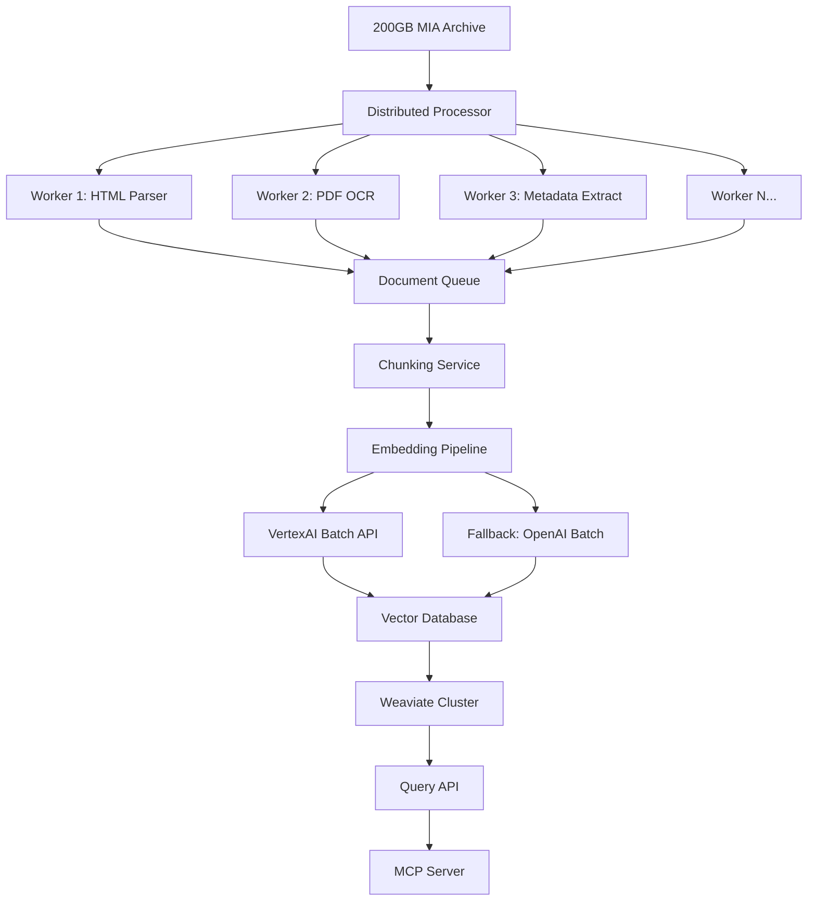

# CLAUDE_ENTERPRISE.md: AI Agent Guidelines for 200GB MIA RAG System

## ⚠️ CRITICAL: Scale Change Notice

**Original assumption**: 38GB archive
**Reality**: **200GB+ corpus**
**Implication**: Complete architecture redesign required for enterprise scale

## Core Principles (Adapted from canvas-to-hugo)

### 1. Documentation-First Approach

**BEFORE implementing any module:**

1. Read this entire document
2. Read your assigned module specification in `specs/`
3. Document all assumptions about scale handling
4. Create ADRs for architectural decisions
5. Maintain work logs in `work-logs/YYYYMMDD-HHMMSS-module.md`

### 2. Test-Driven Development at Scale

**Mandatory testing levels:**

1. **Unit tests**: Component functionality
2. **Integration tests**: Module interfaces
3. **Scale tests**: Performance with GB-sized samples
4. **Stress tests**: Memory and CPU limits
5. **End-to-end tests**: Full pipeline on subset

**Testing pyramid for 200GB:**

```
    /\     E2E (1% sample)
   /  \    Integration (10% sample)
  /    \   Scale Tests (GB chunks)
 /______\  Unit Tests (all logic)
```

### 3. Parallel Development Discipline

**Module assignments for parallel Claude instances:**

- **Instance A**: Distributed Processing Orchestrator
- **Instance B**: Embedding Pipeline (VertexAI/alternatives)
- **Instance C**: Vector Database Interface
- **Instance D**: Query & Retrieval Engine
- **Instance E**: MCP Server Implementation
- **Instance F**: Monitoring & Observability

## 🏗️ Enterprise Architecture (200GB Scale)

### Embedding Solutions

**📌 PRIMARY RECOMMENDATION: Runpod.io GPU Rental**

See **[RUNPOD_EMBEDDINGS.md](./RUNPOD_EMBEDDINGS.md)** for complete implementation guide.

- **Total cost: $40-60** (vs $500-1000 for APIs)
- RTX 4090 rental at $0.50/hour
- BAAI/bge-large-en-v1.5 model (beats OpenAI ada-002)
- Full implementation code included

### Embedding Solutions Comparison

| Solution | Pros | Cons | Cost Estimate | Recommendation |
|----------|------|------|---------------|----------------|
| **Runpod.io GPU Rental** | • 10-20x cheaper than APIs<br>• Full control<br>• No rate limits<br>• Choose any model<br>• Complete privacy | • Requires setup<br>• ~1 week runtime | **$40-60 total** | ✅ **PRIMARY CHOICE** |
| **VertexAI Embeddings** | • Google scale infrastructure<br>• Batch API for millions of docs<br>• Multi-language models<br>• SLA guarantees | • Requires GCP setup<br>• Not fully local<br>• API rate limits | ~$500-1000 for 200GB | Alternative if speed critical |
| **AWS Bedrock** | • Titan embeddings<br>• Good batch processing<br>• VPC endpoints | • AWS complexity<br>• Region limitations | ~$600-1200 | Alternative |
| **OpenAI Batch API** | • ada-002 quality<br>• Batch pricing (50% off)<br>• Simple integration | • Not local<br>• Rate limits<br>• Privacy concerns | ~$400-800 | Budget option |
| **Cohere Embed** | • 1024d embeddings<br>• Multilingual<br>• Good compression | • Smaller company<br>• Less infrastructure | ~$500-900 | Good alternative |
| **Self-hosted (8xA100)** | • Full control<br>• No API limits<br>• Privacy | • $50K+ hardware<br>• Maintenance burden | High CAPEX | For sensitive data |

### Vector Database Recommendations

| Database | Scale Capability | Pros | Cons | Recommendation |
|----------|-----------------|------|------|----------------|
| **Weaviate** | Billions of vectors | • Native multi-tenancy<br>• Hybrid search<br>• Production-grade<br>• Good GCP integration | • Complex setup<br>• Resource intensive | ✅ **PRIMARY CHOICE** |
| **Qdrant** | 100M+ vectors per node | • Excellent performance<br>• Good filtering<br>• Rust-based speed | • Newer, less proven<br>• Limited managed options | Strong alternative |
| **Pinecone** | Unlimited (managed) | • Fully managed<br>• Auto-scaling<br>• Simple API | • Vendor lock-in<br>• Monthly costs<br>• Not self-hostable | For quick start |
| **Milvus** | Trillion-scale | • Battle-tested<br>• Open source<br>• GPU acceleration | • Complex operations<br>• Heavy resource use | For maximum scale |
| **Elasticsearch + vector** | Large scale | • Hybrid text+vector<br>• Mature ecosystem | • Not vector-native<br>• Complex tuning | If already using ES |
| **pgvector** | ~10M vectors | • Simple PostgreSQL<br>• ACID compliant | • **Won't handle 200GB** | ❌ Too small |

### Processing Architecture



## 📋 Implementation Strategy

### Phase 1: Infrastructure Setup (Week 1)

**Instance A Tasks:**

```python
# Distributed Processing Setup
- [ ] Set up Ray/Dask cluster for distributed processing
- [ ] Implement job queue (Redis/RabbitMQ)
- [ ] Create worker pool management
- [ ] Add checkpointing for resume capability
- [ ] Implement progress tracking
```

**Instance B Tasks:**

```python
# VertexAI Integration
- [ ] Set up GCP project and authentication
- [ ] Implement VertexAI batch embeddings client
- [ ] Add retry logic with exponential backoff
- [ ] Create fallback to OpenAI batch API
- [ ] Implement embedding caching layer
```

**Instance C Tasks:**

```python
# Vector Database Setup
- [ ] Deploy Weaviate cluster (3+ nodes)
- [ ] Configure sharding strategy
- [ ] Set up backup/recovery
- [ ] Implement batch insertion pipeline
- [ ] Create monitoring dashboards
```

### Phase 2: Processing Pipeline (Week 2)

**Parallel Processing Strategy:**

```python
# Shard the 200GB corpus
shards = [
    "marxists-000-010GB",  # Instance A
    "marxists-010-020GB",  # Instance B
    "marxists-020-030GB",  # Instance C
    # ... up to 20 shards
]

# Each Claude instance processes different shards
# Coordinate via shared progress tracking
```

### Phase 3: Optimization (Week 3)

**Performance Targets:**

- Processing throughput: 10GB/hour minimum
- Embedding generation: 100K docs/hour
- Query latency: <100ms p50, <500ms p99
- Concurrent queries: 100+ QPS

## 🔧 Tooling & Infrastructure

### Required Services

```yaml
# docker-compose.enterprise.yml
version: '3.8'

services:
  # Message Queue
  rabbitmq:
    image: rabbitmq:3.12-management
    ports:
      - "5672:5672"
      - "15672:15672"
    volumes:
      - rabbitmq_data:/var/lib/rabbitmq

  # Distributed Cache
  redis:
    image: redis:7-alpine
    ports:
      - "6379:6379"
    volumes:
      - redis_data:/data

  # Vector Database
  weaviate:
    image: semitechnologies/weaviate:latest
    ports:
      - "8080:8080"
    environment:
      - CLUSTER_HOSTNAME=node1
      - CLUSTER_GOSSIP_BIND_PORT=7100
      - CLUSTER_DATA_BIND_PORT=7101
    volumes:
      - weaviate_data:/var/lib/weaviate

  # Monitoring
  prometheus:
    image: prom/prometheus:latest
    ports:
      - "9090:9090"
    volumes:
      - ./prometheus.yml:/etc/prometheus/prometheus.yml
      - prometheus_data:/prometheus

  grafana:
    image: grafana/grafana:latest
    ports:
      - "3000:3000"
    volumes:
      - grafana_data:/var/lib/grafana

volumes:
  rabbitmq_data:
  redis_data:
  weaviate_data:
  prometheus_data:
  grafana_data:
```

### Development Environment

```bash
# Required Python packages for enterprise scale
pip install --break-system-packages \
  ray[default]           # Distributed computing
  dask[complete]         # Alternative to Ray
  google-cloud-aiplatform # VertexAI
  weaviate-client        # Vector DB
  redis                  # Caching/queue
  pika                   # RabbitMQ client
  prometheus-client      # Metrics
  structlog              # Structured logging
  tenacity              # Retry logic
  tqdm                  # Progress bars
  msgpack               # Efficient serialization
```

## 📊 Work Logging Protocol (Enhanced)

### Scale-Specific Metrics

Each work session MUST track:

```markdown
## Performance Metrics
- Documents processed: X,XXX
- Processing rate: XX GB/hour
- Memory peak: XX GB
- CPU utilization: XX%
- Embedding API calls: X,XXX
- API cost incurred: $XXX
- Vectors inserted: X,XXX,XXX
- Insertion rate: XX,XXX/sec
- Errors/failures: XX
- Retry count: XX

## Scale Testing Results
- Test corpus size: XX GB
- Time to process: XX hours
- Bottlenecks identified: [list]
- Optimization opportunities: [list]
```

### Confidence Levels for Scale

When implementing distributed systems:

- **95-100%**: Proven pattern at this scale (e.g., Ray for distribution)
- **80-94%**: Should work based on documentation/benchmarks
- **60-79%**: Theoretical capability, needs validation
- **<60%**: Requires proof-of-concept before proceeding

## 🚨 Anti-Patterns at Scale

### ❌ Loading Everything in Memory

```python
# NEVER DO THIS with 200GB
all_docs = load_all_documents()  # 💥 OOM
```

### ❌ Sequential Processing

```python
# Will take weeks
for doc in documents:
    process(doc)  # Process one at a time
```

### ❌ Synchronous API Calls

```python
# Will hit rate limits immediately
for chunk in chunks:
    embedding = get_embedding(chunk)  # One by one
```

### ❌ No Checkpointing

```python
# Can't resume after failure
process_all()  # 48 hours later... crash at 99%
```

## ✅ Best Practices at Scale

### ✅ Streaming & Chunking

```python
def process_corpus():
    for batch in read_in_chunks(corpus_path, chunk_size="1GB"):
        yield from process_batch(batch)
```

### ✅ Distributed Processing

```python
import ray

@ray.remote
def process_shard(shard_path):
    # Process independently
    return processed_data

# Process all shards in parallel
futures = [process_shard.remote(s) for s in shards]
results = ray.get(futures)
```

### ✅ Batch API Calls

```python
async def batch_embeddings(texts, batch_size=100):
    batches = [texts[i:i+batch_size]
               for i in range(0, len(texts), batch_size)]

    tasks = [get_batch_embeddings(batch) for batch in batches]
    return await asyncio.gather(*tasks)
```

### ✅ Checkpoint Everything

```python
class CheckpointedProcessor:
    def __init__(self):
        self.checkpoint = self.load_checkpoint()

    def process(self, items):
        for i, item in enumerate(items):
            if i <= self.checkpoint['last_processed']:
                continue  # Skip already processed

            result = process_item(item)
            self.save_checkpoint({'last_processed': i})
            yield result
```

## 🎯 Success Criteria

### Minimum Viable Pipeline

- [ ] Process 10GB sample successfully
- [ ] Generate embeddings for 100K documents
- [ ] Insert 1M vectors into database
- [ ] Query returns relevant results <500ms
- [ ] System handles worker failures gracefully

### Production Ready

- [ ] Process full 200GB corpus
- [ ] Generate embeddings for all documents
- [ ] Store all vectors (10M+ estimated)
- [ ] Query latency <100ms p50
- [ ] Support 100+ concurrent queries
- [ ] Full monitoring and alerting
- [ ] Automated backup/recovery
- [ ] Cost optimization implemented

## 🔥 Parallel Development Assignments

### Claude Instance Prompts

**Instance A - Distributed Processing:**

```
I need to implement the distributed processing orchestrator for a 200GB corpus.
Read CLAUDE_ENTERPRISE.md and specs/02-DOCUMENT-PROCESSING-SPEC.md.
Focus on Ray/Dask setup, job queue, and worker management.
The system must handle failures and support checkpointing.
```

**Instance B - Embedding Pipeline:**

```
I need to implement the embedding pipeline using VertexAI.
Read CLAUDE_ENTERPRISE.md and implement batch embedding generation.
Include fallback to OpenAI, retry logic, and cost tracking.
Target: 100K documents/hour throughput.
```

**Instance C - Vector Database:**

```
I need to set up Weaviate for 10M+ vectors from a 200GB corpus.
Read CLAUDE_ENTERPRISE.md and implement the vector storage layer.
Include sharding, batch insertion, and monitoring.
Target: 10K insertions/second.
```

**Instance D - Query Engine:**

```
I need to implement the query engine for the vector database.
Read CLAUDE_ENTERPRISE.md and specs/04-QUERY-INTERFACE-SPEC.md.
Include caching, query optimization, and <100ms latency target.
```

**Instance E - MCP Server:**

```
I need to implement the MCP server wrapping the query engine.
Read CLAUDE_ENTERPRISE.md and specs/05-MCP-INTEGRATION-SPEC.md.
Focus on tool definitions and PercyBrain integration.
```

**Instance F - Monitoring:**

```
I need to implement monitoring for the entire pipeline.
Read CLAUDE_ENTERPRISE.md and set up Prometheus + Grafana.
Track processing rates, costs, errors, and performance metrics.
```

## 📚 References

- [Ray Documentation](https://docs.ray.io/)
- [VertexAI Embeddings Guide](https://cloud.google.com/vertex-ai/docs/generative-ai/embeddings/get-text-embeddings)
- [Weaviate at Scale](https://weaviate.io/developers/weaviate/concepts/cluster)
- [Distributed Systems Patterns](https://martinfowler.com/articles/patterns-of-distributed-systems/)

---

**Remember**: At 200GB scale, every architectural decision has massive cost and time implications. Test thoroughly on small samples before running on the full corpus. Your discipline in checkpointing and monitoring will determine whether this project succeeds or fails catastrophically.
