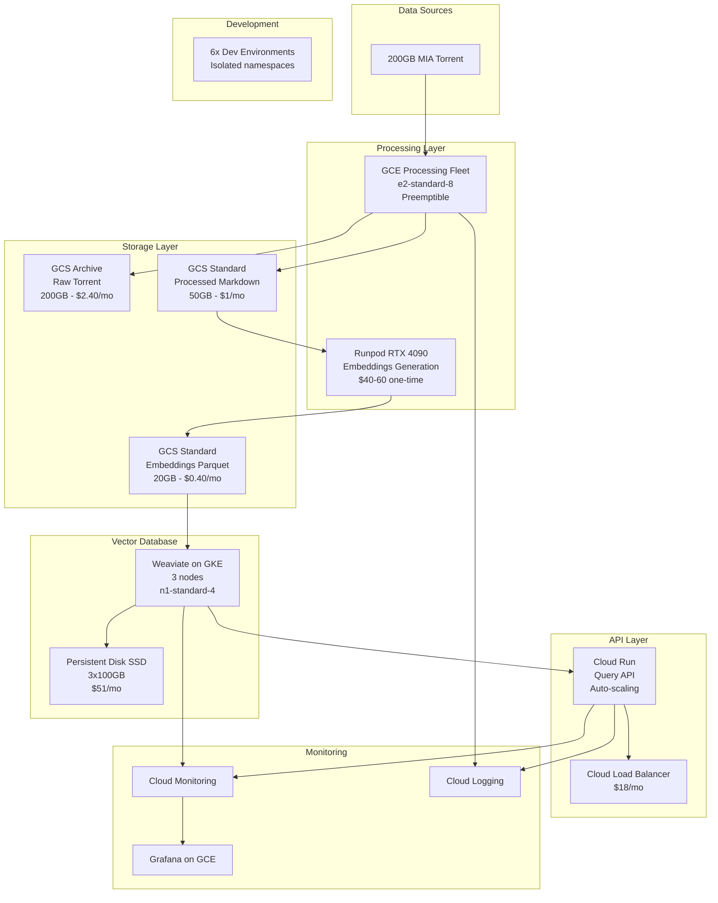

# Cloud Architecture Plan for 200GB MIA RAG System

## Executive Summary

This document defines the complete cloud infrastructure architecture for processing and hosting a 200GB Marxist Internet Archive RAG system. The architecture prioritizes cost-effectiveness while maintaining enterprise-scale capabilities, supporting 6+ parallel development instances, and ensuring production reliability.

**Key Decisions:**
- **Primary Cloud Provider**: Google Cloud Platform (GCP)
- **Embedding Generation**: Runpod.io GPU rental ($40-60 one-time)
- **Vector Database**: Weaviate on GKE
- **Expected Costs**: ~$120-200 one-time, $80-100/month ongoing

## 1. Cloud Provider Comparison

### Primary Recommendation: Google Cloud Platform (GCP)

| Criteria | GCP | AWS | Azure | Winner |
|----------|-----|-----|-------|--------|
| **Storage Pricing (200GB Archive)** | $2.40/month | $3.60/month | $3.00/month | GCP ✅ |
| **Compute (Preemptible/Spot)** | $0.01/hour (e2) | $0.015/hour (t3) | $0.012/hour (B) | GCP ✅ |
| **Weaviate Integration** | Native GKE support | EKS compatible | AKS compatible | GCP ✅ |
| **Egress Costs** | $0.08/GB | $0.09/GB | $0.087/GB | GCP ✅ |
| **Free Tier** | Generous | Limited time | Limited | GCP ✅ |
| **Python SDK** | Excellent | Excellent | Good | Tie |
| **Terraform Support** | Excellent | Excellent | Good | Tie |
| **Learning Curve** | Moderate | Steep | Moderate | GCP/Azure |

**Rationale for GCP:**
1. Lowest storage costs for archival data (critical for 200GB corpus)
2. Best integration with Weaviate via GKE marketplace
3. Simpler networking model than AWS
4. Strong AI/ML ecosystem if we need Vertex AI as fallback
5. Good balance of features and complexity

### Alternative Configurations

#### AWS Architecture
```yaml
Storage: S3 with Intelligent Tiering
Compute: EC2 Spot Fleet
Vector DB: OpenSearch or self-hosted Weaviate on EKS
Embeddings: Bedrock (if not using Runpod)
Monitoring: CloudWatch + Grafana
Cost: ~$200-300/month
```

#### Azure Architecture
```yaml
Storage: Blob Storage with Archive tier
Compute: Spot VMs with VMSS
Vector DB: Azure Cognitive Search or AKS Weaviate
Embeddings: Azure OpenAI (if not using Runpod)
Monitoring: Azure Monitor + Grafana
Cost: ~$190-280/month
```

## 2. Complete Infrastructure Architecture

### High-Level Architecture Diagram



### Network Architecture

```yaml
VPC Design:
  name: mia-rag-vpc
  cidr: 10.0.0.0/16

  subnets:
    - name: processing-subnet
      cidr: 10.0.1.0/24
      purpose: Processing VMs

    - name: weaviate-subnet
      cidr: 10.0.2.0/24
      purpose: Weaviate cluster

    - name: api-subnet
      cidr: 10.0.3.0/24
      purpose: API services

    - name: monitoring-subnet
      cidr: 10.0.4.0/24
      purpose: Monitoring stack

  security:
    - Private Google Access: enabled
    - Cloud NAT: enabled (outbound only)
    - Firewall: Least privilege rules
    - IAP: SSH access only
```

### Security Architecture

```yaml
IAM Structure:
  Organization:
    - mia-rag-project

  Service Accounts:
    - processing-sa: Storage read/write
    - weaviate-sa: Storage read, compute admin
    - api-sa: Weaviate read, monitoring write
    - monitoring-sa: Read all, alert publish

  Secrets Management:
    - Google Secret Manager for API keys
    - Workload Identity for GKE
    - Least privilege everywhere

  Compliance:
    - VPC Service Controls
    - Cloud Armor DDoS protection
    - Binary Authorization for containers
    - Cloud KMS for encryption keys
```

## 3. Component Specifications

### 3.1 Storage Components

| Component | Service | Configuration | Monthly Cost |
|-----------|---------|--------------|--------------|
| Raw Torrent | GCS Archive | 200GB, single-region, 90-day retrieval | $2.40 |
| Processed Markdown | GCS Standard→Nearline | 50GB, lifecycle at 30 days | $1.00 |
| Embeddings | GCS Standard | 20GB Parquet, versioned | $0.40 |
| Vector DB Data | Persistent Disk SSD | 3x100GB, daily snapshots | $51.00 |
| Backups | GCS Nearline | 100GB rolling backups | $1.00 |
| **Total Storage** | | | **$55.80/month** |

### 3.2 Compute Components

| Component | Service | Configuration | Monthly Cost |
|-----------|---------|--------------|--------------|
| Weaviate Cluster | GKE | 3x n1-standard-4 (preemptible) | $50-75 |
| API Services | Cloud Run | 2 vCPU, 4GB RAM, auto-scale | $10-20 |
| Monitoring | GCE | e2-medium for Grafana | $25 |
| Dev Environments | GKE | Shared cluster, namespaces | $30 |
| **Total Compute** | | | **$115-150/month** |

### 3.3 Networking Components

| Component | Service | Configuration | Monthly Cost |
|-----------|---------|--------------|--------------|
| Load Balancer | Cloud LB | Regional, HTTPS | $18 |
| Cloud NAT | NAT Gateway | For outbound traffic | $45 |
| Cloud CDN | CDN | For static assets (optional) | $0-10 |
| **Total Networking** | | | **$63-73/month** |

## 4. Scalability Considerations

### Vertical Scaling Limits

```yaml
Storage:
  GCS: No practical limit (petabyte-scale)
  Weaviate: 100M vectors per node (300M total)

Compute:
  Processing: Up to 96 vCPU per VM
  Weaviate: Up to n1-highmem-96 if needed
  API: Cloud Run scales to 1000 instances

Throughput:
  Ingestion: 10K vectors/second
  Queries: 1000 QPS with caching
  Embeddings: Limited by GPU (Runpod)
```

### Horizontal Scaling Strategy

```yaml
Phase 1 (Current - 200GB):
  Weaviate: 3 nodes
  API: 2-5 instances
  Cost: $80-100/month

Phase 2 (500GB):
  Weaviate: 5 nodes
  API: 5-10 instances
  Cost: $150-200/month

Phase 3 (1TB+):
  Weaviate: 10+ nodes with sharding
  API: Regional multi-cluster
  Cost: $300-500/month
```

## 5. Disaster Recovery

### Backup Strategy

```yaml
Continuous:
  - Weaviate snapshots every 6 hours to GCS
  - Transaction logs to Cloud Storage

Daily:
  - Full vector DB backup
  - Metadata export
  - Configuration backup

Weekly:
  - Cross-region backup copy
  - Backup verification test

Monthly:
  - Disaster recovery drill
  - Restore test to dev environment
```

### RTO/RPO Targets

| Scenario | RTO | RPO | Method |
|----------|-----|-----|--------|
| Node failure | 5 min | 0 | Kubernetes auto-recovery |
| Zone failure | 15 min | 0 | Multi-zone deployment |
| Data corruption | 2 hours | 6 hours | Restore from snapshot |
| Region failure | 24 hours | 24 hours | Cross-region backup |

## 6. Monitoring & Observability

### Metrics Collection

```yaml
Infrastructure Metrics:
  - CPU, Memory, Disk, Network (1-minute intervals)
  - Container metrics via GKE
  - Custom metrics via Prometheus

Application Metrics:
  - Query latency (p50, p95, p99)
  - Embedding generation rate
  - Vector insertion rate
  - Error rates by component

Business Metrics:
  - Total queries per day
  - Unique users
  - Cost per query
  - Storage growth rate
```

### Alerting Rules

```yaml
Critical Alerts:
  - Weaviate cluster down
  - API error rate >5%
  - Storage quota exceeded
  - Budget threshold reached (80%)

Warning Alerts:
  - High latency (p99 >1s)
  - Disk usage >80%
  - Memory pressure
  - Backup failure

Info Alerts:
  - Daily cost report
  - Weekly usage summary
  - Monthly trend analysis
```

### Dashboards

```yaml
Operational Dashboard:
  - Real-time system health
  - Active queries
  - Resource utilization
  - Error rates

Cost Dashboard:
  - Daily spend by service
  - Projected monthly cost
  - Cost per query trends
  - Storage growth projection

Performance Dashboard:
  - Query latency distribution
  - Throughput graphs
  - Cache hit rates
  - Slow query log
```

## 7. Development Environments

### Environment Separation

```yaml
Production:
  Project: mia-rag-prod
  Weaviate: 3-node cluster
  Data: Full 200GB corpus
  Access: Restricted, audit logged

Staging:
  Project: mia-rag-staging
  Weaviate: 2-node cluster
  Data: 10GB sample
  Access: Development team

Development:
  Project: mia-rag-dev
  Weaviate: Single node
  Data: 1GB sample
  Access: Per-developer namespaces
```

### Developer Instance Isolation

```yaml
Instance 1 (Storage):
  Namespace: dev-storage
  Resources:
    - Bucket: gs://mia-dev-storage-1/
    - Service Account: storage-dev-1@

Instance 2 (Embeddings):
  Namespace: dev-embeddings
  Resources:
    - Bucket: gs://mia-dev-embeddings-2/
    - Redis: redis-dev-2

Instance 3 (Weaviate):
  Namespace: dev-weaviate
  Resources:
    - Cluster: weaviate-dev-3
    - PV: weaviate-data-dev-3

Instance 4 (API):
  Namespace: dev-api
  Resources:
    - Cloud Run: api-dev-4
    - Endpoint: https://api-dev-4.run.app

Instance 5 (MCP):
  Namespace: dev-mcp
  Resources:
    - Config: mcp-config-dev-5
    - Test data: gs://mia-dev-mcp-5/

Instance 6 (Monitoring):
  Namespace: dev-monitoring
  Resources:
    - Grafana: grafana-dev-6
    - Prometheus: prom-dev-6
```

## 8. Cost Optimization Strategies

### Immediate Optimizations

1. **Preemptible/Spot Instances** (Save 60-80%)
   - Use for all processing workloads
   - Weaviate nodes (with proper HA setup)
   - Development environments

2. **Storage Lifecycle Policies** (Save 50-80%)
   - Archive tier for raw torrent
   - Nearline for older processed data
   - Auto-delete dev data after 30 days

3. **Committed Use Discounts** (Save 40-60%)
   - 1-year commitment for base capacity
   - Applies to Weaviate cluster

### Long-term Optimizations

1. **Caching Strategy** (Reduce queries by 60%)
   - Redis cache for common queries
   - CDN for static responses
   - Client-side caching

2. **Data Compression** (Save 40-60% storage)
   - Parquet for embeddings (60% compression)
   - Zstd for markdown (50% compression)
   - Deduplication for similar content

3. **Autoscaling** (Save 30-50% on compute)
   - Scale Weaviate based on query load
   - Scale API based on requests
   - Schedule dev environment shutdown

## 9. Migration Strategy

### From Development to Production

```bash
# Phase 1: Infrastructure
terraform apply -var="environment=prod"

# Phase 2: Data Migration
gsutil -m rsync -r gs://mia-dev/ gs://mia-prod/

# Phase 3: Weaviate Import
python scripts/migrate_vectors.py \
  --source=weaviate-dev \
  --target=weaviate-prod \
  --batch-size=10000

# Phase 4: Verification
python scripts/verify_migration.py

# Phase 5: DNS Cutover
gcloud dns record-sets transaction start --zone=mia-zone
gcloud dns record-sets transaction add --name=api.mia-rag.org \
  --type=A --ttl=300 --zone=mia-zone --rrdatas=PROD_IP
gcloud dns record-sets transaction execute --zone=mia-zone
```

## 10. Implementation Roadmap

### Week 1: Foundation
- [ ] Create GCP project structure
- [ ] Set up Terraform state backend
- [ ] Deploy networking foundation
- [ ] Create storage buckets
- [ ] Set up monitoring basics

### Week 2: Processing Infrastructure
- [ ] Deploy processing VMs
- [ ] Set up job queue (Cloud Tasks)
- [ ] Create Runpod integration
- [ ] Test with 1GB sample

### Week 3: Vector Database
- [ ] Deploy GKE cluster
- [ ] Install Weaviate
- [ ] Configure persistence
- [ ] Load test data
- [ ] Verify query performance

### Week 4: API & Integration
- [ ] Deploy Cloud Run services
- [ ] Set up load balancer
- [ ] Configure Cloud CDN
- [ ] MCP server integration
- [ ] End-to-end testing

### Week 5: Production Readiness
- [ ] Security audit
- [ ] Performance optimization
- [ ] Disaster recovery test
- [ ] Documentation completion
- [ ] Handover preparation

## 11. Risk Mitigation

| Risk | Probability | Impact | Mitigation |
|------|-------------|--------|------------|
| Runpod GPU unavailable | Low | High | Have VertexAI as fallback ($500 extra) |
| Weaviate scaling issues | Medium | High | Design for sharding from start |
| Cost overrun | Medium | Medium | Daily budget alerts, caps |
| Data loss | Low | High | Multiple backup strategies |
| Vendor lock-in | Low | Medium | Terraform for portability |

## 12. Success Metrics

### Technical Metrics
- [ ] Process 200GB corpus successfully
- [ ] Generate embeddings for all documents
- [ ] Query latency <100ms p50, <500ms p99
- [ ] 99.9% uptime SLA
- [ ] Support 100+ concurrent queries

### Cost Metrics
- [ ] One-time processing <$200
- [ ] Monthly operational <$100
- [ ] Cost per query <$0.001
- [ ] Storage growth <10% monthly

### Development Metrics
- [ ] 6 instances working in parallel
- [ ] No resource conflicts
- [ ] <1 hour to provision new env
- [ ] All tests passing in CI/CD

## Appendix A: Quick Commands

```bash
# Deploy infrastructure
cd terraform/environments/prod
terraform init
terraform plan
terraform apply

# Check costs
gcloud billing budgets list
gcloud billing accounts get-iam-policy BILLING_ACCOUNT_ID

# Monitor system
gcloud monitoring dashboards list
kubectl top nodes -n weaviate

# Backup Weaviate
kubectl exec -n weaviate weaviate-0 -- \
  curl -X POST localhost:8080/v1/backups/filesystem

# Test query performance
python scripts/load_test.py --qps=100 --duration=300
```

## Appendix B: Cost Calculator

```python
# Monthly cost calculator
def calculate_monthly_cost(
    storage_gb=270,  # 200 raw + 50 markdown + 20 embeddings
    weaviate_nodes=3,
    api_requests=1000000,
    dev_instances=6
):
    # Storage costs
    archive_cost = 200 * 0.012  # $0.012/GB for Archive
    standard_cost = 70 * 0.020  # $0.020/GB for Standard

    # Compute costs (preemptible)
    weaviate_cost = weaviate_nodes * 0.05 * 24 * 30  # $0.05/hour

    # API costs
    api_cost = (api_requests / 1000000) * 10  # $10 per million

    # Networking
    lb_cost = 18  # Fixed cost

    # Development
    dev_cost = dev_instances * 5  # $5 per instance

    total = (archive_cost + standard_cost + weaviate_cost +
             api_cost + lb_cost + dev_cost)

    return {
        'storage': archive_cost + standard_cost,
        'compute': weaviate_cost,
        'api': api_cost,
        'networking': lb_cost,
        'development': dev_cost,
        'total': total
    }

# Example calculation
costs = calculate_monthly_cost()
print(f"Estimated monthly cost: ${costs['total']:.2f}")
```

---

This architecture provides enterprise-scale capabilities at startup costs, with clear paths for scaling and optimization as the system grows.