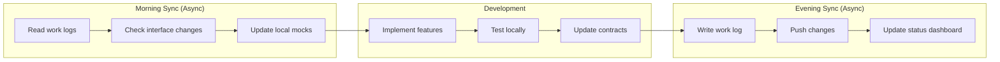

# Parallel Development Architecture for 6-Instance Coordination

## Executive Summary

This document defines the architecture and protocols for coordinating 6+ parallel Claude Code instances working on the MIA RAG system. The architecture ensures zero conflicts, clear boundaries, and efficient integration while maintaining development velocity.

**Key Principles:**

- Each instance owns specific modules with clear interfaces
- Lock-free development through isolation
- Async communication via documentation
- Integration through well-defined contracts
- Progress visibility through shared dashboards

## 1. Instance Assignments and Ownership

### Module Ownership Matrix

| Instance | ID | Module | Responsibilities | Dependencies |
|----------|----|---------|--------------------|-----------------|
| **Instance 1** | `storage` | Storage & Data Pipeline | • GCS bucket management<br>• Data ingestion pipeline<br>• Lifecycle policies<br>• Backup strategies | None (Foundation) |
| **Instance 2** | `embeddings` | Runpod Embeddings | • GPU orchestration<br>• Embedding generation<br>• Parquet storage<br>• Batch processing | Storage (read) |
| **Instance 3** | `weaviate` | Vector Database | • Weaviate deployment<br>• Index management<br>• Query optimization<br>• Persistence | Embeddings (read) |
| **Instance 4** | `api` | Query & API Layer | • REST API<br>• Query processing<br>• Response caching<br>• Rate limiting | Weaviate (read) |
| **Instance 5** | `mcp` | MCP Integration | • MCP server<br>• Tool definitions<br>• Claude integration<br>• Protocol handling | API (consume) |
| **Instance 6** | `monitoring` | Monitoring & Testing | • Metrics collection<br>• Dashboards<br>• Integration tests<br>• Performance monitoring | All (observe) |

### Detailed Instance Specifications

## Instance 1: Storage & Data Pipeline

**Owner**: `storage`
**Repository Path**: `src/storage/`, `src/pipeline/`

```yaml
Responsibilities:
  Primary:
    - Implement GCS storage abstractions
    - Create data ingestion pipeline
    - Handle file format conversions
    - Manage storage lifecycle policies

  Interfaces Provided:
    - StorageClient (read/write/list)
    - PipelineOrchestrator
    - DataValidator

  Output Contracts:
    - Processed markdown in gs://mia-processed-markdown/
    - Metadata in gs://mia-metadata/
    - Standard frontmatter format

Resources:
  Development:
    - Bucket: gs://mia-dev-storage/
    - Service Account: storage-dev@
    - Namespace: dev-storage

  Testing:
    - Local filesystem mocks
    - MinIO for S3 compatibility
    - Test fixtures in tests/fixtures/storage/
```

## Instance 2: Embeddings Pipeline

**Owner**: `embeddings`
**Repository Path**: `src/embeddings/`

```yaml
Responsibilities:
  Primary:
    - Runpod GPU orchestration
    - Embedding model management
    - Batch processing optimization
    - Parquet file generation

  Dependencies:
    - Storage.list_markdown_files()
    - Storage.read_file()
    - Storage.write_embedding()

  Interfaces Provided:
    - EmbeddingGenerator
    - BatchProcessor
    - EmbeddingReader

  Output Contracts:
    - Embeddings in gs://mia-embeddings/
    - Parquet schema (defined in STORAGE-STRATEGY.md)
    - Checkpoint files for resume

Resources:
  Development:
    - Runpod API mock
    - Local embedding cache
    - Bucket: gs://mia-dev-embeddings/
```

## Instance 3: Weaviate Infrastructure

**Owner**: `weaviate`
**Repository Path**: `src/vectordb/`

```yaml
Responsibilities:
  Primary:
    - Weaviate cluster management
    - Schema definition
    - Import pipelines
    - Query optimization

  Dependencies:
    - Embeddings.read_parquet()
    - Storage.get_metadata()

  Interfaces Provided:
    - WeaviateClient
    - SchemaManager
    - ImportManager
    - QueryEngine

  Output Contracts:
    - Weaviate REST API at :8080
    - GraphQL endpoint
    - Backup snapshots

Resources:
  Development:
    - Local Weaviate Docker
    - Test collection: dev-weaviate-3
    - 1GB sample data
```

## Instance 4: Query & API Layer

**Owner**: `api`
**Repository Path**: `src/api/`

```yaml
Responsibilities:
  Primary:
    - REST API implementation
    - Query parsing and routing
    - Response formatting
    - Caching layer

  Dependencies:
    - Weaviate.query()
    - Weaviate.get_by_id()

  Interfaces Provided:
    - GET /search
    - GET /document/{id}
    - POST /query
    - GET /health

  Output Contracts:
    - OpenAPI specification
    - JSON response format
    - Error codes

Resources:
  Development:
    - Local FastAPI server
    - Redis cache
    - Endpoint: http://localhost:8000
```

## Instance 5: MCP Server

**Owner**: `mcp`
**Repository Path**: `src/mcp/`

```yaml
Responsibilities:
  Primary:
    - MCP protocol implementation
    - Tool definitions
    - Request/response handling
    - Claude integration

  Dependencies:
    - API.search()
    - API.get_document()

  Interfaces Provided:
    - MCP server on stdio
    - Tool: search_marxist_theory
    - Tool: find_by_author
    - Tool: get_context

  Output Contracts:
    - MCP protocol compliance
    - Tool schemas
    - Response format

Resources:
  Development:
    - MCP test harness
    - Mock Claude client
    - Config: mcp-config-dev.json
```

## Instance 6: Monitoring & Integration

**Owner**: `monitoring`
**Repository Path**: `src/monitoring/`, `tests/integration/`

```yaml
Responsibilities:
  Primary:
    - Prometheus metrics
    - Grafana dashboards
    - Integration testing
    - Performance benchmarking

  Dependencies:
    - All modules (observability)

  Interfaces Provided:
    - Metrics endpoint :9090
    - Dashboards :3000
    - Test orchestration
    - Performance reports

  Output Contracts:
    - Metric definitions
    - Alert rules
    - Test reports
    - SLA monitoring

Resources:
  Development:
    - Local Prometheus
    - Grafana instance
    - Test orchestrator
```

## 2. Communication Protocols

### 2.1 Async Documentation Protocol

```yaml
Protocol: Documentation-Driven Communication

Principles:
  - All decisions documented in ADRs
  - Interface changes require RFC
  - Progress tracked in work logs
  - No synchronous meetings required

Flow:
  1. Instance identifies interface need
  2. Creates RFC in docs/rfcs/
  3. Other instances review async (24h window)
  4. Approval via PR comment
  5. Implementation proceeds
  6. Interface contract updated

Example RFC:
  Title: RFC-001: Embedding Storage Format
  Author: Instance 2 (embeddings)
  Status: Proposed
  Affected: Instance 1 (storage), Instance 3 (weaviate)

  Proposal:
    Change embedding storage from JSON to Parquet

  Interface Change:
    - Old: read_embeddings() -> Dict
    - New: read_embeddings() -> pa.Table

  Migration:
    Backwards compatible with converter
```

### 2.2 Integration Points

```python
# src/interfaces/contracts.py

from abc import ABC, abstractmethod
from typing import List, Dict, Optional
import numpy as np

class StorageInterface(ABC):
    """Contract between Storage and other modules."""

    @abstractmethod
    def list_files(self, prefix: str, file_type: str) -> List[str]:
        """List files in storage."""
        pass

    @abstractmethod
    def read_file(self, path: str) -> str:
        """Read file content."""
        pass

    @abstractmethod
    def write_file(self, path: str, content: str) -> bool:
        """Write file to storage."""
        pass

class EmbeddingInterface(ABC):
    """Contract between Embeddings and other modules."""

    @abstractmethod
    def get_embedding_batch(self, chunk_ids: List[str]) -> Dict[str, np.ndarray]:
        """Retrieve embeddings by chunk IDs."""
        pass

    @abstractmethod
    def get_embedding_metadata(self) -> Dict:
        """Get embedding generation metadata."""
        pass

class WeaviateInterface(ABC):
    """Contract between Weaviate and other modules."""

    @abstractmethod
    def search(self, vector: List[float], limit: int = 10) -> List[Dict]:
        """Vector similarity search."""
        pass

    @abstractmethod
    def get_by_id(self, doc_id: str) -> Optional[Dict]:
        """Retrieve document by ID."""
        pass

    @abstractmethod
    def filter_search(self, vector: List[float], filters: Dict) -> List[Dict]:
        """Search with metadata filters."""
        pass

class APIInterface(ABC):
    """Contract between API and other modules."""

    @abstractmethod
    def query(self, text: str, filters: Optional[Dict] = None) -> Dict:
        """Process text query."""
        pass

    @abstractmethod
    def get_document(self, doc_id: str) -> Optional[Dict]:
        """Retrieve full document."""
        pass
```

## 3. Development Workflow

### 3.1 Daily Development Cycle



### 3.2 Git Branch Strategy

```yaml
Branch Structure:
  main:
    - Production-ready code
    - Protected, requires reviews

  develop:
    - Integration branch
    - Daily merges from feature branches

  feature/[instance]-[feature]:
    - Instance-specific development
    - Examples:
      - feature/storage-gcs-lifecycle
      - feature/embeddings-parquet
      - feature/weaviate-schema-v2

  test/integration-[date]:
    - Daily integration testing
    - Combines all instance work

Merge Strategy:
  1. Instance works on feature branch
  2. Daily PR to develop
  3. Integration tests run automatically
  4. Conflicts resolved by instance owner
  5. Weekly merge to main
```

### 3.3 Work Log Protocol

```markdown
# Work Log: Instance 2 (Embeddings)
Date: 2024-01-15
Session: 14:00-18:00 UTC

## Completed
- ✅ Implemented Parquet writer for embeddings
- ✅ Added batch processing with checkpointing
- ✅ Created mock Runpod API for testing

## Interface Changes
- Modified: `EmbeddingStorage.write()` now returns checkpoint_id
- Added: `EmbeddingStorage.resume(checkpoint_id)`
- Backwards compatible: Yes

## Blockers
- None

## Tomorrow
- Implement retry logic for failed batches
- Add progress tracking API

## Integration Notes
- Instance 3: New Parquet format ready for testing
- Instance 6: Metrics endpoint available at :9091/metrics
```

## 4. Conflict Resolution

### 4.1 Resource Conflicts

```yaml
Conflict Types:
  Storage:
    Rule: Each instance has dedicated bucket/prefix
    Example: gs://mia-dev/instance1/*, gs://mia-dev/instance2/*

  Compute:
    Rule: Isolated namespaces in GKE
    Example: namespace=dev-instance1, namespace=dev-instance2

  Networking:
    Rule: Port ranges assigned per instance
    Example: Instance1: 8001-8099, Instance2: 8101-8199

  Database:
    Rule: Separate collections/schemas
    Example: weaviate.instance1_test, weaviate.instance2_test
```

### 4.2 Code Conflicts

```python
# scripts/check_conflicts.py

import ast
import sys
from pathlib import Path
from typing import Set, Dict

class ConflictChecker:
    """Check for conflicts between instance changes."""

    def __init__(self):
        self.instance_files = {
            'instance1': set(),
            'instance2': set(),
            'instance3': set(),
            'instance4': set(),
            'instance5': set(),
            'instance6': set()
        }

    def scan_changes(self, branch: str) -> Set[str]:
        """Scan git changes in branch."""
        import subprocess

        result = subprocess.run(
            ['git', 'diff', '--name-only', f'develop..{branch}'],
            capture_output=True,
            text=True
        )

        return set(result.stdout.strip().split('\n'))

    def check_overlaps(self) -> Dict[str, Set[str]]:
        """Check for file overlaps between instances."""
        overlaps = {}

        for i1, files1 in self.instance_files.items():
            for i2, files2 in self.instance_files.items():
                if i1 >= i2:
                    continue

                overlap = files1 & files2
                if overlap:
                    overlaps[f"{i1}-{i2}"] = overlap

        return overlaps

    def report_conflicts(self):
        """Generate conflict report."""
        overlaps = self.check_overlaps()

        if not overlaps:
            print("✅ No conflicts detected")
            return 0

        print("❌ Conflicts detected:")
        for pair, files in overlaps.items():
            print(f"\n{pair}:")
            for f in files:
                print(f"  - {f}")

        return 1

if __name__ == "__main__":
    checker = ConflictChecker()
    sys.exit(checker.report_conflicts())
```

## 5. Integration Testing

### 5.1 Daily Integration Pipeline

```yaml
# .github/workflows/daily-integration.yml

name: Daily Integration Test

on:
  schedule:
    - cron: '0 2 * * *'  # 2 AM UTC daily
  workflow_dispatch:

jobs:
  merge-branches:
    runs-on: ubuntu-latest
    steps:
      - uses: actions/checkout@v3
        with:
          ref: develop

      - name: Create integration branch
        run: |
          git checkout -b integration/$(date +%Y%m%d)

      - name: Merge instance branches
        run: |
          for i in {1..6}; do
            git merge --no-ff feature/instance${i}-current || true
          done

  run-integration:
    needs: merge-branches
    runs-on: ubuntu-latest

    services:
      weaviate:
        image: semitechnologies/weaviate:latest
        ports:
          - 8080:8080

      redis:
        image: redis:alpine
        ports:
          - 6379:6379

    steps:
      - name: Run integration tests
        run: |
          pytest tests/integration/ \
            --verbose \
            --junit-xml=integration-report.xml

      - name: Check interface compliance
        run: |
          python scripts/check_interfaces.py

      - name: Performance regression test
        run: |
          python scripts/performance_test.py \
            --baseline=baselines/latest.json

      - name: Generate report
        if: always()
        run: |
          python scripts/generate_integration_report.py \
            > integration-report.md

      - name: Post to Slack
        if: always()
        run: |
          python scripts/post_slack.py \
            --channel=mia-rag-dev \
            --file=integration-report.md
```

### 5.2 Integration Test Scenarios

```python
# tests/integration/test_full_pipeline.py

import pytest
from pathlib import Path
import time

class TestFullPipeline:
    """End-to-end integration tests."""

    def test_storage_to_embeddings_flow(self, storage_client, embedding_client):
        """Test Instance 1 → Instance 2 integration."""

        # Instance 1: Upload test markdown
        test_file = "test_doc.md"
        storage_client.upload(
            content="# Test Document\n\nContent here...",
            path=f"markdown/{test_file}"
        )

        # Instance 2: Process embedding
        files = storage_client.list_files(prefix="markdown/")
        assert test_file in files

        content = storage_client.read_file(f"markdown/{test_file}")
        embedding = embedding_client.generate(content)

        assert len(embedding) == 768

        # Save embedding
        embedding_client.save_embedding(
            doc_id=test_file,
            embedding=embedding
        )

    def test_embeddings_to_weaviate_flow(self, embedding_client, weaviate_client):
        """Test Instance 2 → Instance 3 integration."""

        # Instance 2: Get embeddings
        embeddings = embedding_client.get_batch(limit=10)

        # Instance 3: Import to Weaviate
        for emb in embeddings:
            weaviate_client.add_document(
                doc_id=emb['doc_id'],
                vector=emb['embedding'],
                metadata=emb['metadata']
            )

        # Verify import
        count = weaviate_client.get_count()
        assert count >= 10

    def test_weaviate_to_api_flow(self, weaviate_client, api_client):
        """Test Instance 3 → Instance 4 integration."""

        # Instance 3: Ensure data exists
        test_vector = [0.1] * 768
        weaviate_results = weaviate_client.search(test_vector, limit=5)

        # Instance 4: Query via API
        api_results = api_client.search(
            query="test query",
            limit=5
        )

        assert len(api_results['results']) > 0
        assert 'content' in api_results['results'][0]

    def test_api_to_mcp_flow(self, api_client, mcp_client):
        """Test Instance 4 → Instance 5 integration."""

        # Instance 4: API is running
        health = api_client.health_check()
        assert health['status'] == 'healthy'

        # Instance 5: MCP tool execution
        result = mcp_client.execute_tool(
            tool="search_marxist_theory",
            params={"query": "surplus value", "limit": 3}
        )

        assert result['success']
        assert len(result['results']) > 0

    def test_complete_flow(self, all_services):
        """Test complete pipeline Instance 1 → 5."""

        # 1. Upload document
        all_services.storage.upload("content", "test.md")

        # 2. Generate embedding
        embedding = all_services.embeddings.generate("content")

        # 3. Store in Weaviate
        all_services.weaviate.add(embedding)

        # 4. Query via API
        results = all_services.api.search("content")

        # 5. Access via MCP
        mcp_results = all_services.mcp.search("content")

        # 6. Monitor metrics
        metrics = all_services.monitoring.get_metrics()

        assert metrics['documents_processed'] > 0
        assert metrics['queries_served'] > 0
```

## 6. Progress Tracking

### 6.1 Shared Status Dashboard

```python
# src/monitoring/status_dashboard.py

from flask import Flask, render_template
import json
from pathlib import Path
from datetime import datetime

app = Flask(__name__)

class StatusDashboard:
    """Shared dashboard for all instances."""

    def __init__(self):
        self.status_file = Path("status.json")

    def get_instance_status(self, instance_id: str) -> dict:
        """Get status for specific instance."""
        if not self.status_file.exists():
            return {"status": "unknown"}

        with open(self.status_file) as f:
            data = json.load(f)

        return data.get(instance_id, {"status": "unknown"})

    def update_status(self, instance_id: str, status: dict):
        """Update instance status."""
        current = {}
        if self.status_file.exists():
            with open(self.status_file) as f:
                current = json.load(f)

        current[instance_id] = {
            **status,
            "updated_at": datetime.now().isoformat()
        }

        with open(self.status_file, 'w') as f:
            json.dump(current, f, indent=2)

    def get_overall_progress(self) -> dict:
        """Calculate overall project progress."""
        if not self.status_file.exists():
            return {"progress": 0}

        with open(self.status_file) as f:
            data = json.load(f)

        total_tasks = 0
        completed_tasks = 0

        for instance_id, status in data.items():
            tasks = status.get('tasks', {})
            total_tasks += len(tasks)
            completed_tasks += sum(
                1 for t in tasks.values()
                if t.get('status') == 'completed'
            )

        return {
            "progress": (completed_tasks / total_tasks * 100) if total_tasks else 0,
            "total_tasks": total_tasks,
            "completed_tasks": completed_tasks,
            "instances": len(data)
        }

@app.route('/')
def dashboard():
    """Render status dashboard."""
    dashboard = StatusDashboard()

    instances = []
    for i in range(1, 7):
        instance_id = f"instance{i}"
        status = dashboard.get_instance_status(instance_id)
        instances.append({
            "id": instance_id,
            "name": ["Storage", "Embeddings", "Weaviate", "API", "MCP", "Monitoring"][i-1],
            **status
        })

    overall = dashboard.get_overall_progress()

    return render_template(
        'dashboard.html',
        instances=instances,
        overall=overall
    )

if __name__ == "__main__":
    app.run(host='0.0.0.0', port=5000, debug=True)
```

### 6.2 Progress CLI Tool

```python
#!/usr/bin/env python3
# scripts/progress.py

import click
import json
from pathlib import Path
from datetime import datetime
from rich.console import Console
from rich.table import Table
from rich.progress import Progress, BarColumn, TextColumn

console = Console()

@click.group()
def cli():
    """Progress tracking for parallel development."""
    pass

@cli.command()
@click.argument('instance_id')
@click.argument('task')
@click.argument('status', type=click.Choice(['pending', 'in_progress', 'completed', 'blocked']))
def update(instance_id, task, status):
    """Update task status for an instance."""
    status_file = Path("status.json")

    data = {}
    if status_file.exists():
        with open(status_file) as f:
            data = json.load(f)

    if instance_id not in data:
        data[instance_id] = {"tasks": {}}

    data[instance_id]["tasks"][task] = {
        "status": status,
        "updated": datetime.now().isoformat()
    }

    with open(status_file, 'w') as f:
        json.dump(data, f, indent=2)

    console.print(f"✅ Updated {instance_id}/{task} to {status}")

@cli.command()
def show():
    """Show current progress across all instances."""
    status_file = Path("status.json")

    if not status_file.exists():
        console.print("No status data available")
        return

    with open(status_file) as f:
        data = json.load(f)

    # Create table
    table = Table(title="Parallel Development Progress")
    table.add_column("Instance", style="cyan")
    table.add_column("Module", style="magenta")
    table.add_column("Tasks", style="green")
    table.add_column("Progress", style="yellow")

    module_names = ["Storage", "Embeddings", "Weaviate", "API", "MCP", "Monitoring"]

    for i in range(1, 7):
        instance_id = f"instance{i}"
        instance_data = data.get(instance_id, {"tasks": {}})
        tasks = instance_data.get("tasks", {})

        total = len(tasks)
        completed = sum(1 for t in tasks.values() if t['status'] == 'completed')
        progress = f"{completed}/{total}" if total else "0/0"

        table.add_row(
            instance_id,
            module_names[i-1],
            str(total),
            progress
        )

    console.print(table)

    # Overall progress
    total_tasks = sum(
        len(d.get("tasks", {}))
        for d in data.values()
    )
    completed_tasks = sum(
        sum(1 for t in d.get("tasks", {}).values() if t['status'] == 'completed')
        for d in data.values()
    )

    console.print(f"\nOverall Progress: {completed_tasks}/{total_tasks} tasks completed")

@cli.command()
@click.argument('instance_id')
def report(instance_id):
    """Generate work report for an instance."""
    # Would generate detailed report
    pass

if __name__ == "__main__":
    cli()
```

## 7. Communication Channels

### 7.1 Async Communication Stack

```yaml
Documentation:
  - Work logs: Daily async updates
  - RFCs: Interface changes
  - ADRs: Architectural decisions

Code:
  - Pull requests: Code review
  - Issues: Bug tracking
  - Discussions: Design questions

Monitoring:
  - Status dashboard: Real-time progress
  - Metrics: Performance tracking
  - Alerts: Critical issues

Notifications:
  - Email: Daily digest
  - Slack: Critical alerts only
  - GitHub: PR/Issue notifications
```

### 7.2 Instance Communication Matrix

```python
# src/communication/matrix.py

class CommunicationMatrix:
    """Defines how instances communicate."""

    MATRIX = {
        'instance1': {
            'provides': ['storage_api'],
            'consumes': [],
            'notifies': ['instance2']
        },
        'instance2': {
            'provides': ['embeddings_api'],
            'consumes': ['storage_api'],
            'notifies': ['instance3']
        },
        'instance3': {
            'provides': ['weaviate_api'],
            'consumes': ['embeddings_api'],
            'notifies': ['instance4']
        },
        'instance4': {
            'provides': ['rest_api'],
            'consumes': ['weaviate_api'],
            'notifies': ['instance5']
        },
        'instance5': {
            'provides': ['mcp_server'],
            'consumes': ['rest_api'],
            'notifies': ['instance6']
        },
        'instance6': {
            'provides': ['metrics', 'dashboards'],
            'consumes': ['all'],
            'notifies': ['all']
        }
    }

    @classmethod
    def get_dependencies(cls, instance: str) -> list:
        """Get dependencies for an instance."""
        return cls.MATRIX[instance]['consumes']

    @classmethod
    def get_consumers(cls, instance: str) -> list:
        """Get consumers of an instance's APIs."""
        consumers = []
        api = cls.MATRIX[instance]['provides'][0] if cls.MATRIX[instance]['provides'] else None

        if api:
            for inst, data in cls.MATRIX.items():
                if api in data['consumes']:
                    consumers.append(inst)

        return consumers

    @classmethod
    def generate_dependency_graph(cls):
        """Generate visual dependency graph."""
        import graphviz

        dot = graphviz.Digraph('Dependencies')

        for instance, data in cls.MATRIX.items():
            # Add node
            dot.node(instance, instance)

            # Add edges
            for consumer in data['consumes']:
                provider = cls._find_provider(consumer)
                if provider:
                    dot.edge(provider, instance)

        return dot

    @classmethod
    def _find_provider(cls, api: str) -> str:
        """Find which instance provides an API."""
        for instance, data in cls.MATRIX.items():
            if api in data['provides']:
                return instance
        return None
```

## 8. Best Practices

### 8.1 Development Guidelines

```yaml
DO:
  - Work only in your assigned modules
  - Update work logs daily
  - Test with local mocks first
  - Document interface changes
  - Use semantic versioning
  - Create integration tests
  - Monitor resource usage

DON'T:
  - Modify another instance's code
  - Break existing interfaces
  - Use production resources for dev
  - Skip documentation
  - Ignore test failures
  - Create resource conflicts
  - Block other instances
```

### 8.2 Code Review Protocol

```yaml
Review Process:
  Self-Review:
    - Run all tests locally
    - Check interface compliance
    - Verify no conflicts
    - Update documentation

  Peer Review:
    - Automated checks must pass
    - Interface changes reviewed by consumers
    - Performance impact assessed
    - Security review if applicable

  Merge Criteria:
    - All tests passing
    - No conflicts detected
    - Documentation updated
    - Consumer instances notified
```

## 9. Emergency Procedures

### 9.1 Rollback Protocol

```bash
#!/bin/bash
# scripts/emergency_rollback.sh

INSTANCE=$1
LAST_GOOD_COMMIT=$2

echo "Emergency rollback for $INSTANCE to $LAST_GOOD_COMMIT"

# Create rollback branch
git checkout -b rollback/$INSTANCE-$(date +%s)

# Revert to last good commit
git revert --no-edit HEAD..$LAST_GOOD_COMMIT

# Run tests
pytest -m $INSTANCE --fail-fast

if [ $? -eq 0 ]; then
    echo "Rollback successful"
    git push origin rollback/$INSTANCE-$(date +%s)
else
    echo "Rollback failed - manual intervention required"
    exit 1
fi
```

### 9.2 Instance Recovery

```python
# scripts/instance_recovery.py

class InstanceRecovery:
    """Recover failed instance work."""

    def diagnose_failure(self, instance: str):
        """Diagnose what went wrong."""
        # Check logs
        # Check resource state
        # Check dependencies
        pass

    def isolate_instance(self, instance: str):
        """Isolate failed instance from others."""
        # Disable integrations
        # Route around failure
        # Notify other instances
        pass

    def recover_state(self, instance: str):
        """Recover to last known good state."""
        # Restore from backup
        # Reset to checkpoint
        # Rebuild from source
        pass
```

## 10. Success Metrics

### 10.1 Key Performance Indicators

```yaml
Development Velocity:
  - Tasks completed per day per instance
  - Integration test pass rate
  - Time to resolve conflicts
  - Code review turnaround

Quality Metrics:
  - Test coverage per module
  - Interface compliance rate
  - Documentation completeness
  - Bug escape rate

Collaboration Metrics:
  - Cross-instance integration success
  - RFC approval time
  - Conflict frequency
  - Communication effectiveness
```

### 10.2 Success Dashboard

```python
# src/monitoring/success_metrics.py

class SuccessMetrics:
    """Track success of parallel development."""

    def calculate_velocity(self) -> float:
        """Calculate development velocity."""
        # Tasks completed / days
        pass

    def calculate_quality(self) -> float:
        """Calculate code quality score."""
        # Test coverage * pass rate * doc coverage
        pass

    def calculate_integration_health(self) -> float:
        """Calculate integration health score."""
        # Successful integrations / total attempts
        pass

    def generate_report(self) -> dict:
        """Generate success metrics report."""
        return {
            'velocity': self.calculate_velocity(),
            'quality': self.calculate_quality(),
            'integration': self.calculate_integration_health(),
            'overall': self._calculate_overall_score()
        }
```

---

This parallel development architecture enables 6+ Claude instances to work together efficiently without conflicts, with clear ownership, communication protocols, and integration strategies.
