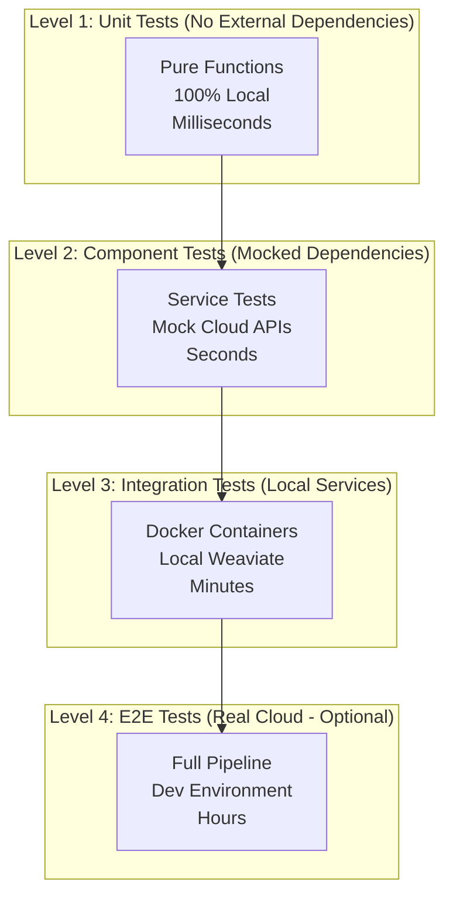

# Parallel Test Strategy for 6-Instance Development

## Executive Summary

This document defines the comprehensive testing strategy that enables 6+ parallel Claude Code instances to develop and test the MIA RAG system without requiring cloud resources initially. The strategy emphasizes isolation, mock services, and deterministic test data.

**Key Principles:**
- Tests run locally without cloud dependencies
- Each instance has isolated test environment
- Shared test fixtures for consistency
- Progressive testing levels from unit to E2E
- No conflicts between parallel test runs

## 1. Test Architecture Overview

### Testing Pyramid for Parallel Development



### Instance Test Isolation

| Instance | Module | Test Focus | Mock Requirements |
|----------|--------|------------|-------------------|
| 1 | Storage & Pipeline | File I/O, chunking | GCS mocks |
| 2 | Embeddings | Vector generation | GPU mocks, API mocks |
| 3 | Weaviate | Vector DB operations | Weaviate testcontainer |
| 4 | Query API | Search, retrieval | Mock Weaviate responses |
| 5 | MCP | Server protocol | Mock Claude API |
| 6 | Monitoring | Metrics, alerts | Mock Prometheus |

## 2. Test Infrastructure

### Directory Structure

```
tests/
├── __init__.py
├── conftest.py                    # Shared pytest fixtures
├── pytest.ini                     # Pytest configuration
├── requirements-test.txt          # Test dependencies
│
├── fixtures/                      # Shared test data
│   ├── samples/
│   │   ├── 1mb_sample.tar.gz    # Tiny sample for unit tests
│   │   ├── 100mb_sample.tar.gz  # Small sample for integration
│   │   └── 1gb_sample.tar.gz    # Large sample for performance
│   ├── embeddings/
│   │   ├── sample_embeddings.parquet
│   │   └── mock_embeddings.json
│   └── expected/
│       ├── processed_markdown/
│       └── query_results/
│
├── unit/                         # Level 1: Pure unit tests
│   ├── test_chunking.py
│   ├── test_metadata_extraction.py
│   ├── test_parquet_io.py
│   └── test_query_parsing.py
│
├── component/                    # Level 2: Component tests
│   ├── test_storage_service.py
│   ├── test_embedding_service.py
│   ├── test_weaviate_client.py
│   └── test_api_endpoints.py
│
├── integration/                  # Level 3: Integration tests
│   ├── test_processing_pipeline.py
│   ├── test_ingestion_flow.py
│   ├── test_query_flow.py
│   └── test_mcp_integration.py
│
├── e2e/                         # Level 4: End-to-end tests
│   ├── test_full_pipeline.py
│   └── test_production_queries.py
│
├── performance/                  # Performance benchmarks
│   ├── test_processing_speed.py
│   ├── test_query_latency.py
│   └── test_memory_usage.py
│
├── mocks/                       # Mock implementations
│   ├── mock_gcs.py
│   ├── mock_weaviate.py
│   ├── mock_embeddings.py
│   └── mock_runpod.py
│
└── utils/                       # Test utilities
    ├── data_generators.py
    ├── assertions.py
    └── benchmarking.py
```

## 3. Level 1: Unit Tests (No Dependencies)

### 3.1 Pure Function Testing

```python
# tests/unit/test_chunking.py

import pytest
from pathlib import Path
from src.processing.chunker import SemanticChunker, TokenChunker

class TestSemanticChunking:
    """Test semantic chunking without any external dependencies."""

    @pytest.fixture
    def sample_text(self):
        """Load sample text from fixture."""
        fixture_path = Path(__file__).parent.parent / "fixtures/samples/marx_capital_ch1.txt"
        return fixture_path.read_text()

    @pytest.fixture
    def chunker(self):
        """Create chunker instance."""
        return SemanticChunker(max_tokens=512)

    def test_chunk_respects_max_tokens(self, chunker, sample_text):
        """Ensure no chunk exceeds max tokens."""
        chunks = chunker.chunk(sample_text)

        for chunk in chunks:
            token_count = len(chunk.split())
            assert token_count <= 512, f"Chunk exceeded max tokens: {token_count}"

    def test_chunk_preserves_paragraphs(self, chunker):
        """Semantic chunker should preserve paragraph boundaries."""
        text = "Paragraph one.\n\nParagraph two.\n\nParagraph three."
        chunks = chunker.chunk(text)

        # Should not split mid-paragraph
        for chunk in chunks:
            assert not chunk.startswith(" ")
            assert not chunk.endswith(" two")

    def test_empty_input_handling(self, chunker):
        """Handle empty input gracefully."""
        assert chunker.chunk("") == []
        assert chunker.chunk(None) == []

    @pytest.mark.parametrize("chunk_size", [128, 256, 512, 1024])
    def test_different_chunk_sizes(self, sample_text, chunk_size):
        """Test chunking with various sizes."""
        chunker = SemanticChunker(max_tokens=chunk_size)
        chunks = chunker.chunk(sample_text)

        assert all(len(c.split()) <= chunk_size for c in chunks)
        assert len(chunks) > 0

    def test_chunk_overlap(self, chunker):
        """Test overlapping chunks for context preservation."""
        text = " ".join([f"Sentence {i}." for i in range(100)])
        chunks = chunker.chunk(text, overlap=50)

        # Verify overlap exists
        for i in range(len(chunks) - 1):
            chunk1_end = chunks[i].split()[-50:]
            chunk2_start = chunks[i+1].split()[:50]
            # Some overlap should exist
            assert len(set(chunk1_end) & set(chunk2_start)) > 0
```

### 3.2 Metadata Extraction Testing

```python
# tests/unit/test_metadata_extraction.py

import pytest
from datetime import datetime
from src.processing.metadata import MetadataExtractor

class TestMetadataExtraction:
    """Test metadata extraction without external dependencies."""

    @pytest.fixture
    def extractor(self):
        return MetadataExtractor()

    def test_extract_yaml_frontmatter(self, extractor):
        """Extract YAML frontmatter from markdown."""
        content = """---
title: Capital Volume 1
author: Karl Marx
date: 1867
---

# Chapter 1
Content here..."""

        metadata = extractor.extract_frontmatter(content)

        assert metadata['title'] == "Capital Volume 1"
        assert metadata['author'] == "Karl Marx"
        assert metadata['date'] == "1867"

    def test_extract_author_from_path(self, extractor):
        """Extract author from file path."""
        test_cases = [
            ("/archive/marx/works/1867-c1/ch01.htm", "marx"),
            ("/archive/engels/1884/origin-family/index.htm", "engels"),
            ("/archive/lenin/works/1917/staterev/ch01.htm", "lenin"),
            ("/reference/archive/unknown/test.htm", "unknown")
        ]

        for path, expected_author in test_cases:
            author = extractor.extract_author_from_path(path)
            assert author == expected_author

    def test_calculate_content_hash(self, extractor):
        """Test content hash generation."""
        content1 = "The wealth of those societies..."
        content2 = "The wealth of those societies..."  # Same
        content3 = "Different content here"

        hash1 = extractor.calculate_hash(content1)
        hash2 = extractor.calculate_hash(content2)
        hash3 = extractor.calculate_hash(content3)

        assert hash1 == hash2  # Same content = same hash
        assert hash1 != hash3  # Different content = different hash
        assert len(hash1) == 64  # SHA256 = 64 hex characters

    @pytest.mark.parametrize("language,expected", [
        ("This is English text", "en"),
        ("Ceci est un texte français", "fr"),
        ("Dies ist deutscher Text", "de"),
        ("", "unknown")
    ])
    def test_detect_language(self, extractor, language, expected):
        """Test language detection."""
        # Note: In real implementation, would use langdetect
        # This is mocked for testing without dependencies
        detected = extractor.detect_language(language)
        assert detected == expected
```

## 4. Level 2: Component Tests (Mocked Dependencies)

### 4.1 Storage Service with Mocks

```python
# tests/component/test_storage_service.py

import pytest
from unittest.mock import Mock, patch, MagicMock
from pathlib import Path
from src.storage.gcs_storage import GCSStorage

class TestGCSStorage:
    """Test GCS storage with mocked client."""

    @pytest.fixture
    def mock_gcs_client(self):
        """Create mock GCS client."""
        with patch('google.cloud.storage.Client') as mock_client:
            mock_bucket = Mock()
            mock_client.return_value.bucket.return_value = mock_bucket
            yield mock_client

    @pytest.fixture
    def storage(self, mock_gcs_client):
        """Create storage instance with mocked client."""
        return GCSStorage(
            project_id="test-project",
            bucket_name="test-bucket"
        )

    def test_upload_file(self, storage, mock_gcs_client):
        """Test file upload with mock."""
        mock_bucket = mock_gcs_client.return_value.bucket.return_value
        mock_blob = Mock()
        mock_bucket.blob.return_value = mock_blob

        # Perform upload
        result = storage.upload(
            local_path="test.txt",
            remote_path="uploads/test.txt",
            content="Test content"
        )

        # Verify mock calls
        mock_bucket.blob.assert_called_once_with("uploads/test.txt")
        mock_blob.upload_from_string.assert_called_once_with("Test content")
        assert result == "gs://test-bucket/uploads/test.txt"

    def test_download_file(self, storage, mock_gcs_client):
        """Test file download with mock."""
        mock_bucket = mock_gcs_client.return_value.bucket.return_value
        mock_blob = Mock()
        mock_blob.download_as_text.return_value = "Downloaded content"
        mock_bucket.blob.return_value = mock_blob

        # Perform download
        content = storage.download("uploads/test.txt")

        # Verify
        mock_bucket.blob.assert_called_once_with("uploads/test.txt")
        assert content == "Downloaded content"

    def test_list_files(self, storage, mock_gcs_client):
        """Test listing files with mock."""
        mock_bucket = mock_gcs_client.return_value.bucket.return_value

        # Create mock blobs
        mock_blobs = [
            Mock(name="file1.txt"),
            Mock(name="file2.txt"),
            Mock(name="dir/file3.txt")
        ]
        mock_bucket.list_blobs.return_value = mock_blobs

        # List files
        files = storage.list_files(prefix="")

        # Verify
        assert len(files) == 3
        assert "file1.txt" in files
        mock_bucket.list_blobs.assert_called_once()

    def test_batch_upload(self, storage, mock_gcs_client):
        """Test batch upload with parallelism."""
        files = [
            ("local1.txt", "remote1.txt", "content1"),
            ("local2.txt", "remote2.txt", "content2"),
            ("local3.txt", "remote3.txt", "content3")
        ]

        results = storage.batch_upload(files)

        assert len(results) == 3
        assert all(r.startswith("gs://") for r in results)
```

### 4.2 Embedding Service with Mocks

```python
# tests/component/test_embedding_service.py

import pytest
import numpy as np
from unittest.mock import Mock, patch, MagicMock
from src.embeddings.embedding_service import EmbeddingService

class TestEmbeddingService:
    """Test embedding service with mocked APIs."""

    @pytest.fixture
    def mock_runpod_api(self):
        """Mock Runpod API responses."""
        with patch('requests.post') as mock_post:
            # Return mock embeddings
            mock_response = Mock()
            mock_response.json.return_value = {
                'embeddings': np.random.randn(768).tolist()
            }
            mock_response.status_code = 200
            mock_post.return_value = mock_response
            yield mock_post

    @pytest.fixture
    def embedding_service(self, mock_runpod_api):
        """Create embedding service with mocked API."""
        return EmbeddingService(
            api_url="http://mock-runpod:8000",
            model="bge-large-en-v1.5"
        )

    def test_generate_single_embedding(self, embedding_service):
        """Test single embedding generation."""
        text = "The commodity form of the product of labour"
        embedding = embedding_service.generate_embedding(text)

        assert len(embedding) == 768
        assert isinstance(embedding, list)
        assert all(isinstance(x, float) for x in embedding)

    def test_batch_embeddings(self, embedding_service):
        """Test batch embedding generation."""
        texts = [
            "First text",
            "Second text",
            "Third text"
        ]

        embeddings = embedding_service.generate_batch(texts)

        assert len(embeddings) == 3
        assert all(len(e) == 768 for e in embeddings)

    def test_embedding_caching(self, embedding_service):
        """Test that embeddings are cached."""
        text = "Cached text"

        # First call - generates embedding
        embedding1 = embedding_service.generate_embedding(text)

        # Second call - should return cached
        embedding2 = embedding_service.generate_embedding(text)

        assert embedding1 == embedding2
        # Mock should only be called once due to caching
        # (Would verify with mock call count in real test)

    def test_retry_on_failure(self, embedding_service, mock_runpod_api):
        """Test retry logic on API failure."""
        # Configure mock to fail then succeed
        mock_runpod_api.side_effect = [
            Exception("Connection error"),
            Mock(json=lambda: {'embeddings': [0.1] * 768}, status_code=200)
        ]

        embedding = embedding_service.generate_embedding("Test", retry=True)

        assert embedding is not None
        assert len(embedding) == 768
        assert mock_runpod_api.call_count == 2

    @pytest.mark.parametrize("batch_size", [10, 50, 100, 500])
    def test_different_batch_sizes(self, embedding_service, batch_size):
        """Test various batch sizes."""
        texts = [f"Text {i}" for i in range(batch_size)]

        embeddings = embedding_service.generate_batch(
            texts,
            batch_size=min(batch_size, 100)  # API limit
        )

        assert len(embeddings) == batch_size
```

## 5. Level 3: Integration Tests (Local Services)

### 5.1 Weaviate with TestContainers

```python
# tests/integration/test_weaviate_integration.py

import pytest
import docker
import time
import weaviate
from testcontainers.compose import DockerCompose

class TestWeaviateIntegration:
    """Test Weaviate operations with local Docker container."""

    @pytest.fixture(scope="class")
    def weaviate_container(self):
        """Start Weaviate container for testing."""
        compose = DockerCompose(
            filepath="tests/docker",
            compose_file_name="docker-compose-test.yml"
        )

        with compose:
            # Wait for Weaviate to be ready
            time.sleep(10)

            yield "http://localhost:8080"

    @pytest.fixture
    def weaviate_client(self, weaviate_container):
        """Create Weaviate client connected to test container."""
        client = weaviate.Client(weaviate_container)

        # Create test schema
        schema = {
            "classes": [{
                "class": "Document",
                "properties": [
                    {"name": "content", "dataType": ["text"]},
                    {"name": "author", "dataType": ["string"]},
                    {"name": "title", "dataType": ["string"]}
                ]
            }]
        }

        client.schema.create(schema)
        yield client

        # Cleanup
        client.schema.delete_all()

    def test_insert_and_query(self, weaviate_client):
        """Test inserting and querying vectors."""
        # Insert test document
        doc = {
            "content": "The wealth of those societies...",
            "author": "Karl Marx",
            "title": "Capital Volume 1"
        }

        result = weaviate_client.data_object.create(
            data_object=doc,
            class_name="Document",
            vector=[0.1] * 768  # Mock vector
        )

        assert result is not None

        # Query by vector
        query_result = weaviate_client.query.get(
            "Document",
            ["content", "author", "title"]
        ).with_near_vector({
            "vector": [0.1] * 768
        }).with_limit(1).do()

        assert len(query_result['data']['Get']['Document']) == 1
        assert query_result['data']['Get']['Document'][0]['author'] == "Karl Marx"

    def test_batch_import(self, weaviate_client):
        """Test batch import performance."""
        # Create batch of documents
        documents = []
        for i in range(100):
            documents.append({
                "content": f"Document {i} content",
                "author": f"Author {i}",
                "title": f"Title {i}",
                "vector": np.random.randn(768).tolist()
            })

        # Batch import
        with weaviate_client.batch as batch:
            for doc in documents:
                batch.add_data_object(
                    data_object={
                        "content": doc["content"],
                        "author": doc["author"],
                        "title": doc["title"]
                    },
                    class_name="Document",
                    vector=doc["vector"]
                )

        # Verify import
        count = weaviate_client.query.aggregate("Document").with_meta_count().do()
        assert count['data']['Aggregate']['Document'][0]['meta']['count'] == 100

    def test_filtering(self, weaviate_client):
        """Test filtering with where clause."""
        # Insert test data
        for author in ["Marx", "Engels", "Lenin"]:
            for i in range(5):
                weaviate_client.data_object.create(
                    data_object={
                        "content": f"{author} document {i}",
                        "author": author,
                        "title": f"Title {i}"
                    },
                    class_name="Document",
                    vector=np.random.randn(768).tolist()
                )

        # Query with filter
        result = weaviate_client.query.get(
            "Document",
            ["content", "author"]
        ).with_where({
            "path": ["author"],
            "operator": "Equal",
            "valueString": "Marx"
        }).do()

        marx_docs = result['data']['Get']['Document']
        assert len(marx_docs) == 5
        assert all(d['author'] == "Marx" for d in marx_docs)
```

### 5.2 Full Pipeline Integration

```python
# tests/integration/test_processing_pipeline.py

import pytest
import tempfile
from pathlib import Path
from src.processing.pipeline import ProcessingPipeline

class TestProcessingPipeline:
    """Test complete processing pipeline with local resources."""

    @pytest.fixture
    def sample_corpus(self):
        """Create sample corpus for testing."""
        with tempfile.TemporaryDirectory() as tmpdir:
            corpus_dir = Path(tmpdir) / "corpus"
            corpus_dir.mkdir()

            # Create sample HTML files
            for i in range(10):
                html_file = corpus_dir / f"document_{i}.html"
                html_file.write_text(f"""
                <html>
                <head><title>Document {i}</title></head>
                <body>
                    <h1>Chapter {i}</h1>
                    <p>Content for document {i}...</p>
                </body>
                </html>
                """)

            yield corpus_dir

    @pytest.fixture
    def pipeline(self, sample_corpus):
        """Create processing pipeline."""
        return ProcessingPipeline(
            input_dir=sample_corpus,
            output_dir=Path(tempfile.mkdtemp())
        )

    def test_full_processing(self, pipeline):
        """Test complete processing flow."""
        # Process corpus
        stats = pipeline.process()

        assert stats['html_processed'] == 10
        assert stats['errors'] == 0
        assert stats['total_words'] > 0

        # Verify output files
        markdown_files = list(pipeline.output_dir.glob("**/*.md"))
        assert len(markdown_files) == 10

        # Check markdown format
        sample_md = markdown_files[0].read_text()
        assert "---" in sample_md  # Has frontmatter
        assert "title:" in sample_md
        assert "# Chapter" in sample_md  # Has content

    def test_parallel_processing(self, pipeline):
        """Test parallel processing with multiple workers."""
        stats = pipeline.process(workers=4)

        assert stats['html_processed'] == 10
        # Should be faster with parallel processing
        # (would measure actual time in real test)

    def test_resume_from_checkpoint(self, pipeline):
        """Test resuming from checkpoint after failure."""
        # Process partially
        pipeline.process(limit=5)

        # Simulate crash and resume
        new_pipeline = ProcessingPipeline(
            input_dir=pipeline.input_dir,
            output_dir=pipeline.output_dir,
            resume=True
        )

        stats = new_pipeline.process()

        # Should only process remaining 5
        assert stats['html_processed'] == 5
```

## 6. Parallel Test Execution

### 6.1 Pytest Configuration

```ini
# pytest.ini

[tool:pytest]
minversion = 7.0
testpaths = tests
python_files = test_*.py
python_classes = Test*
python_functions = test_*

# Parallel execution
addopts =
    -n auto
    --dist worksteal
    --maxfail=5
    --strict-markers
    --cov=src
    --cov-report=term-missing
    --cov-report=html
    --cov-fail-under=80

# Markers for selective testing
markers =
    unit: Unit tests (no external dependencies)
    component: Component tests (mocked dependencies)
    integration: Integration tests (local services)
    e2e: End-to-end tests (real cloud)
    slow: Slow tests (>5 seconds)
    instance1: Tests for storage instance
    instance2: Tests for embedding instance
    instance3: Tests for Weaviate instance
    instance4: Tests for API instance
    instance5: Tests for MCP instance
    instance6: Tests for monitoring instance

# Test isolation
tmp_path_retention_policy = "all"
```

### 6.2 Parallel Execution Script

```python
#!/usr/bin/env python3
# run_parallel_tests.py

import subprocess
import sys
from concurrent.futures import ThreadPoolExecutor, as_completed
from pathlib import Path

class ParallelTestRunner:
    """Run tests for all 6 instances in parallel."""

    def __init__(self):
        self.instances = {
            'instance1': ['storage', 'pipeline'],
            'instance2': ['embeddings'],
            'instance3': ['weaviate'],
            'instance4': ['api', 'query'],
            'instance5': ['mcp'],
            'instance6': ['monitoring', 'integration']
        }

    def run_instance_tests(self, instance: str, modules: list) -> dict:
        """Run tests for a specific instance."""
        print(f"Starting tests for {instance}...")

        # Build pytest command
        cmd = [
            'pytest',
            f'-m', instance,  # Use marker
            '--tb=short',
            '--quiet',
            f'--junitxml=reports/{instance}.xml',
            f'--html=reports/{instance}.html',
            '--self-contained-html'
        ]

        # Add specific test modules
        for module in modules:
            cmd.append(f'tests/**/test_{module}*.py')

        # Run tests
        result = subprocess.run(
            cmd,
            capture_output=True,
            text=True
        )

        return {
            'instance': instance,
            'returncode': result.returncode,
            'stdout': result.stdout,
            'stderr': result.stderr
        }

    def run_all_parallel(self):
        """Run all instance tests in parallel."""
        Path('reports').mkdir(exist_ok=True)

        with ThreadPoolExecutor(max_workers=6) as executor:
            futures = {
                executor.submit(
                    self.run_instance_tests, instance, modules
                ): instance
                for instance, modules in self.instances.items()
            }

            results = []
            for future in as_completed(futures):
                result = future.result()
                results.append(result)

                # Print summary
                instance = futures[future]
                status = "✅ PASSED" if result['returncode'] == 0 else "❌ FAILED"
                print(f"{instance}: {status}")

        return results

    def generate_report(self, results):
        """Generate combined test report."""
        report = ["# Parallel Test Results\n"]

        for result in results:
            instance = result['instance']
            status = "PASSED" if result['returncode'] == 0 else "FAILED"

            report.append(f"## {instance}: {status}\n")

            # Parse test output for stats
            if "passed" in result['stdout']:
                report.append(result['stdout'].split('\n')[-2])

            report.append("\n")

        # Write report
        with open('reports/summary.md', 'w') as f:
            f.write('\n'.join(report))

        print("\nTest report written to reports/summary.md")

if __name__ == "__main__":
    runner = ParallelTestRunner()
    results = runner.run_all_parallel()
    runner.generate_report(results)

    # Exit with failure if any tests failed
    if any(r['returncode'] != 0 for r in results):
        sys.exit(1)
```

## 7. Test Data Management

### 7.1 Fixture Generation

```python
# tests/fixtures/generate_fixtures.py

import json
import random
from pathlib import Path
import numpy as np
import pyarrow.parquet as pq
import pyarrow as pa

class FixtureGenerator:
    """Generate test fixtures for all instances."""

    def __init__(self, fixture_dir: Path):
        self.fixture_dir = fixture_dir
        self.fixture_dir.mkdir(exist_ok=True)

    def generate_sample_corpus(self, size_mb: int = 1):
        """Generate sample corpus of specified size."""
        corpus_dir = self.fixture_dir / f"corpus_{size_mb}mb"
        corpus_dir.mkdir(exist_ok=True)

        # Calculate number of documents
        doc_size_kb = 10  # Average document size
        num_docs = (size_mb * 1024) // doc_size_kb

        for i in range(num_docs):
            # Generate varied content
            author = random.choice(["marx", "engels", "lenin", "luxemburg"])
            year = random.randint(1840, 1920)

            content = f"""---
title: Document {i}
author: {author}
date: {year}
---

# Chapter {i % 10}

{self._generate_lorem_marxist(paragraphs=5)}
"""

            doc_file = corpus_dir / f"{author}_{year}_doc{i}.md"
            doc_file.write_text(content)

        print(f"Generated {num_docs} documents in {corpus_dir}")

    def generate_sample_embeddings(self, num_embeddings: int = 1000):
        """Generate sample embeddings in Parquet format."""
        # Create schema
        schema = pa.schema([
            ('chunk_id', pa.string()),
            ('embedding', pa.list_(pa.float32(), 768)),
            ('metadata', pa.string())
        ])

        # Generate data
        data = {
            'chunk_id': [f"chunk_{i}" for i in range(num_embeddings)],
            'embedding': [np.random.randn(768).tolist() for _ in range(num_embeddings)],
            'metadata': [json.dumps({"doc_id": f"doc_{i//10}"}) for i in range(num_embeddings)]
        }

        table = pa.Table.from_pydict(data, schema=schema)

        # Write Parquet file
        output_file = self.fixture_dir / "embeddings" / "sample_embeddings.parquet"
        output_file.parent.mkdir(exist_ok=True)
        pq.write_table(table, output_file, compression='snappy')

        print(f"Generated {num_embeddings} embeddings in {output_file}")

    def generate_expected_outputs(self):
        """Generate expected output files for validation."""
        expected_dir = self.fixture_dir / "expected"
        expected_dir.mkdir(exist_ok=True)

        # Expected markdown format
        expected_markdown = """---
title: Capital, Volume I, Chapter 1
author: Karl Marx
date: 1867
source_url: https://www.marxists.org/archive/marx/works/1867-c1/ch01.htm
content_hash: abc123def456
word_count: 5234
---

# Chapter 1: The Commodity

The wealth of those societies in which the capitalist mode of production prevails...
"""

        (expected_dir / "processed_markdown.md").write_text(expected_markdown)

        # Expected query result
        expected_query = {
            "query": "surplus value",
            "results": [
                {
                    "content": "The surplus value is the source of profit...",
                    "author": "Karl Marx",
                    "title": "Capital Volume 1",
                    "score": 0.95
                }
            ]
        }

        (expected_dir / "query_result.json").write_text(
            json.dumps(expected_query, indent=2)
        )

    def _generate_lorem_marxist(self, paragraphs: int = 3) -> str:
        """Generate Lorem Ipsum with Marxist vocabulary."""
        marxist_terms = [
            "commodity", "labor-power", "surplus value", "capital",
            "bourgeoisie", "proletariat", "means of production",
            "exchange value", "use value", "dialectical materialism",
            "class struggle", "exploitation", "alienation"
        ]

        paragraphs_text = []
        for _ in range(paragraphs):
            sentences = []
            for _ in range(random.randint(3, 6)):
                terms = random.sample(marxist_terms, 3)
                sentence = f"The {terms[0]} relates to {terms[1]} through {terms[2]}."
                sentences.append(sentence)
            paragraphs_text.append(" ".join(sentences))

        return "\n\n".join(paragraphs_text)

# Generate all fixtures
if __name__ == "__main__":
    generator = FixtureGenerator(Path("tests/fixtures"))
    generator.generate_sample_corpus(1)    # 1MB sample
    generator.generate_sample_corpus(100)  # 100MB sample
    generator.generate_sample_embeddings(1000)
    generator.generate_expected_outputs()
```

## 8. CI/CD Integration

### 8.1 GitHub Actions Workflow

```yaml
# .github/workflows/parallel-tests.yml

name: Parallel Test Suite

on:
  push:
    branches: [main, develop]
  pull_request:
    branches: [main]

jobs:
  test-matrix:
    runs-on: ubuntu-latest
    strategy:
      matrix:
        instance: [instance1, instance2, instance3, instance4, instance5, instance6]
      fail-fast: false

    steps:
      - uses: actions/checkout@v3

      - name: Set up Python
        uses: actions/setup-python@v4
        with:
          python-version: '3.11'

      - name: Cache dependencies
        uses: actions/cache@v3
        with:
          path: ~/.cache/pip
          key: ${{ runner.os }}-pip-${{ hashFiles('**/requirements-test.txt') }}

      - name: Install dependencies
        run: |
          pip install -r requirements-test.txt

      - name: Download test fixtures
        uses: actions/cache@v3
        with:
          path: tests/fixtures
          key: test-fixtures-v1

      - name: Run tests for ${{ matrix.instance }}
        run: |
          pytest -m ${{ matrix.instance }} \
            --junitxml=reports/${{ matrix.instance }}.xml \
            --cov=src \
            --cov-report=xml

      - name: Upload test results
        uses: actions/upload-artifact@v3
        with:
          name: test-results-${{ matrix.instance }}
          path: reports/

      - name: Upload coverage
        uses: codecov/codecov-action@v3
        with:
          file: ./coverage.xml
          flags: ${{ matrix.instance }}

  integration-test:
    needs: test-matrix
    runs-on: ubuntu-latest

    services:
      weaviate:
        image: semitechnologies/weaviate:latest
        ports:
          - 8080:8080
        options: --health-cmd "curl -f http://localhost:8080/v1/.well-known/ready"

    steps:
      - uses: actions/checkout@v3

      - name: Run integration tests
        run: |
          pytest tests/integration/ \
            --weaviate-url=http://localhost:8080

  report:
    needs: [test-matrix, integration-test]
    runs-on: ubuntu-latest

    steps:
      - name: Download all test results
        uses: actions/download-artifact@v3
        with:
          path: reports/

      - name: Generate combined report
        run: |
          python scripts/combine_test_reports.py reports/

      - name: Comment on PR
        if: github.event_name == 'pull_request'
        uses: actions/github-script@v6
        with:
          script: |
            const fs = require('fs');
            const report = fs.readFileSync('reports/summary.md', 'utf8');
            github.rest.issues.createComment({
              issue_number: context.issue.number,
              owner: context.repo.owner,
              repo: context.repo.repo,
              body: report
            });
```

## 9. Performance Testing

### 9.1 Benchmark Suite

```python
# tests/performance/test_benchmarks.py

import pytest
import time
import psutil
import tracemalloc
from pathlib import Path

class TestPerformanceBenchmarks:
    """Performance benchmarks for critical paths."""

    @pytest.fixture(autouse=True)
    def setup_monitoring(self):
        """Setup performance monitoring."""
        tracemalloc.start()
        self.start_time = time.time()
        self.start_memory = psutil.Process().memory_info().rss / 1024 / 1024

        yield

        # Report metrics
        current, peak = tracemalloc.get_traced_memory()
        tracemalloc.stop()

        duration = time.time() - self.start_time
        end_memory = psutil.Process().memory_info().rss / 1024 / 1024

        print(f"\nPerformance Metrics:")
        print(f"  Duration: {duration:.2f}s")
        print(f"  Memory used: {end_memory - self.start_memory:.2f} MB")
        print(f"  Peak memory: {peak / 1024 / 1024:.2f} MB")

    @pytest.mark.benchmark
    def test_chunking_speed(self, benchmark):
        """Benchmark chunking speed."""
        from src.processing.chunker import SemanticChunker

        # Load 10MB of text
        text = "Sample text " * 100000  # ~1MB
        chunker = SemanticChunker(max_tokens=512)

        result = benchmark(chunker.chunk, text)

        assert len(result) > 0
        # Should process at least 10MB/second
        assert benchmark.stats['mean'] < 0.1

    @pytest.mark.benchmark
    def test_embedding_generation_speed(self, benchmark):
        """Benchmark embedding generation speed."""
        from tests.mocks.mock_embeddings import MockEmbeddingService

        service = MockEmbeddingService()
        texts = ["Sample text"] * 100

        result = benchmark(service.generate_batch, texts)

        assert len(result) == 100
        # Should generate at least 1000 embeddings/second
        assert benchmark.stats['mean'] < 0.1

    @pytest.mark.benchmark
    def test_query_latency(self, benchmark):
        """Benchmark query latency."""
        from tests.mocks.mock_weaviate import MockWeaviateClient

        client = MockWeaviateClient()
        query_vector = [0.1] * 768

        result = benchmark(client.query, query_vector)

        assert result is not None
        # Should return results in <100ms
        assert benchmark.stats['mean'] < 0.1
```

## 10. Test Orchestration

### 10.1 Master Test Controller

```python
# tests/orchestrator.py

import asyncio
import json
from datetime import datetime
from pathlib import Path
from typing import Dict, List

class TestOrchestrator:
    """Orchestrates tests across all 6 instances."""

    def __init__(self):
        self.instances = ['instance1', 'instance2', 'instance3',
                         'instance4', 'instance5', 'instance6']
        self.results = {}

    async def run_instance_tests(self, instance: str) -> Dict:
        """Run tests for a single instance asynchronously."""
        cmd = f"pytest -m {instance} --json-report --json-report-file=reports/{instance}.json"

        process = await asyncio.create_subprocess_shell(
            cmd,
            stdout=asyncio.subprocess.PIPE,
            stderr=asyncio.subprocess.PIPE
        )

        stdout, stderr = await process.communicate()

        # Parse results
        report_file = Path(f"reports/{instance}.json")
        if report_file.exists():
            with open(report_file) as f:
                report = json.load(f)
        else:
            report = {"error": stderr.decode()}

        return {
            'instance': instance,
            'returncode': process.returncode,
            'report': report,
            'duration': report.get('duration', 0)
        }

    async def run_all(self):
        """Run all instance tests in parallel."""
        print(f"Starting parallel test execution at {datetime.now()}")

        tasks = [
            self.run_instance_tests(instance)
            for instance in self.instances
        ]

        self.results = await asyncio.gather(*tasks)

        self.print_summary()
        self.generate_html_report()

    def print_summary(self):
        """Print test summary to console."""
        print("\n" + "="*60)
        print("PARALLEL TEST RESULTS")
        print("="*60)

        total_tests = 0
        total_passed = 0
        total_duration = 0

        for result in self.results:
            instance = result['instance']
            report = result['report']

            if 'summary' in report:
                summary = report['summary']
                passed = summary.get('passed', 0)
                total = summary.get('total', 0)
                duration = result['duration']

                total_tests += total
                total_passed += passed
                total_duration = max(total_duration, duration)

                status = "✅" if passed == total else "❌"
                print(f"{status} {instance}: {passed}/{total} tests passed ({duration:.2f}s)")

        print("-"*60)
        print(f"TOTAL: {total_passed}/{total_tests} tests passed")
        print(f"Parallel execution time: {total_duration:.2f}s")
        print("="*60)

    def generate_html_report(self):
        """Generate HTML dashboard for test results."""
        # Would generate comprehensive HTML report here
        pass

# Run orchestrator
if __name__ == "__main__":
    orchestrator = TestOrchestrator()
    asyncio.run(orchestrator.run_all())
```

## Summary

This parallel test strategy enables:

1. **Complete isolation** between 6 development instances
2. **No cloud dependencies** for local development
3. **Progressive testing levels** from unit to E2E
4. **Shared fixtures** for consistency
5. **Parallel execution** for speed
6. **Comprehensive reporting** for visibility
7. **CI/CD integration** for automation
8. **Performance benchmarking** for optimization

Each Claude instance can run their tests independently without conflicts, while the orchestration layer ensures integration testing works correctly when modules are combined.