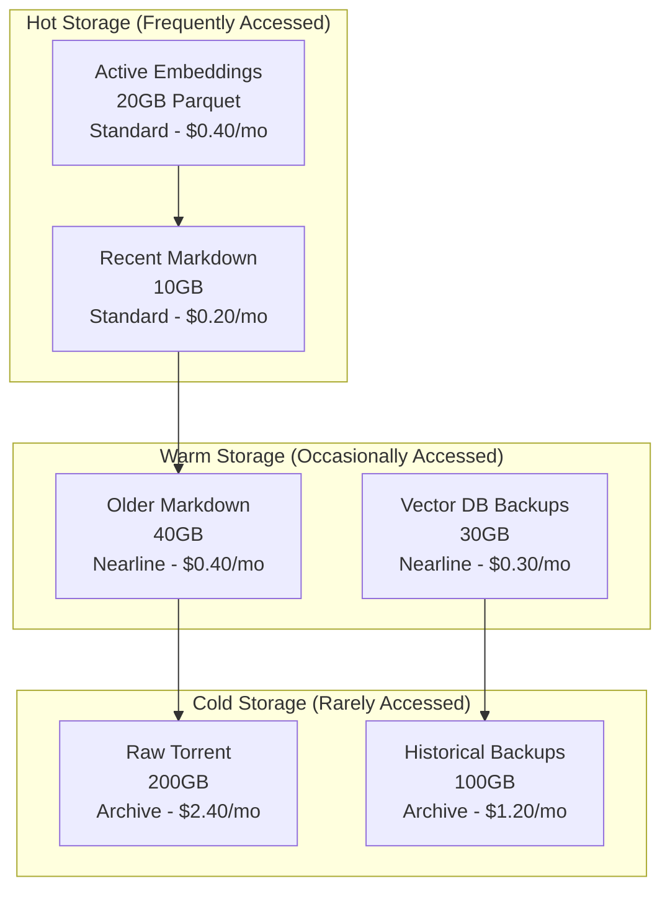

# Storage Strategy for 200GB MIA RAG System

## Executive Summary

This document defines the comprehensive storage strategy for the 200GB Marxist Internet Archive RAG system. The strategy optimizes for cost, performance, and reliability while ensuring embeddings are generated only once and stored permanently.

**Key Decisions:**

- Raw torrent: GCS Archive tier ($2.40/month)
- Processed markdown: GCS Standard→Nearline lifecycle ($1/month)
- Embeddings: Parquet format with Snappy compression ($0.40/month)
- Vector database: Weaviate with persistent SSDs ($51/month)

**Total storage cost: ~$55/month**

## 1. Storage Tiers and Lifecycle

### Storage Hierarchy



### Lifecycle Policies

```yaml
Raw Torrent (200GB):
  Initial: Archive ($0.012/GB/month)
  After: Never changes (permanent archive)
  Access: ~365 day minimum storage duration
  Retrieval: $0.05/GB when needed

Processed Markdown (50GB):
  0-30 days: Standard ($0.020/GB/month)
  30-365 days: Nearline ($0.010/GB/month)
  365+ days: Archive ($0.0012/GB/month)
  Access pattern: Frequent initially, rare after processing

Embeddings (20GB):
  Permanent: Standard ($0.020/GB/month)
  Never transitions (always needed for rebuilds)
  Versioned for safety
  Compressed with Parquet

Vector DB Data:
  Active: SSD persistent disks ($0.170/GB/month)
  Snapshots: Nearline ($0.010/GB/month)
  Retention: 30 days of snapshots
```

## 2. Data Formats and Compression

### 2.1 Raw Torrent Storage

**Format**: Original archive format (mixed HTML/PDF)
**Compression**: Keep as-is (already compressed PDFs)
**Structure**:

```
gs://mia-raw-torrent/
├── dump_www-marxists-org.tar.gz (or original format)
├── metadata.json
└── checksums.sha256
```

### 2.2 Processed Markdown Storage

**Format**: Individual markdown files with YAML frontmatter
**Compression**: Gzip for transport, uncompressed at rest
**Structure**:

```
gs://mia-processed-markdown/
├── by-author/
│   ├── marx/
│   │   ├── capital-vol1-ch01.md
│   │   └── capital-vol1-ch02.md
│   ├── engels/
│   └── lenin/
├── by-date/
│   ├── 1840s/
│   ├── 1850s/
│   └── ...
└── metadata/
    ├── manifest.json
    └── processing-log.json
```

**Markdown Format**:

```markdown
---
title: "Capital, Volume I, Chapter 1"
author: "Karl Marx"
date: "1867"
source_url: "https://www.marxists.org/archive/marx/works/1867-c1/ch01.htm"
content_hash: "sha256:abc123..."
word_count: 5234
language: "en"
processing_date: "2024-01-15T10:30:00Z"
---

# Chapter 1: The Commodity

## Section 1: The Two Factors of a Commodity

The wealth of those societies in which the capitalist mode of production prevails...
```

### 2.3 Embeddings Storage

**Format**: Apache Parquet with Snappy compression
**Compression Ratio**: ~60% reduction from raw
**Schema**:

```python
# Parquet Schema Definition
import pyarrow as pa

embedding_schema = pa.schema([
    ('chunk_id', pa.string()),           # Unique identifier
    ('doc_id', pa.string()),             # Parent document ID
    ('chunk_index', pa.int32()),         # Position in document
    ('content', pa.string()),            # Original text
    ('content_hash', pa.string()),       # SHA256 of content
    ('embedding', pa.list_(pa.float32(), 1024)),  # Vector embedding
    ('metadata', pa.string()),           # JSON metadata
    ('model', pa.string()),              # Embedding model used
    ('created_at', pa.timestamp('us'))   # Timestamp
])

# Partitioning strategy
partitioning = pa.dataset.partitioning(
    pa.schema([
        ('year', pa.int16()),
        ('month', pa.int8()),
        ('author', pa.string())
    ])
)
```

**Storage Structure**:

```
gs://mia-embeddings/
├── version-1.0/
│   ├── model-bge-large-en-v1.5/
│   │   ├── year=1840/
│   │   │   ├── month=1/
│   │   │   │   ├── author=marx/
│   │   │   │   │   ├── part-00000.parquet
│   │   │   │   │   └── part-00001.parquet
│   │   │   │   └── author=engels/
│   │   │   └── month=2/
│   │   └── metadata.json
│   └── _SUCCESS
└── checkpoints/
    └── processing-state.json
```

**Compression Analysis**:

```python
# Size calculations
raw_size = 5_000_000 * 1024 * 4  # 5M chunks × 1024 dims × 4 bytes
# = 20 GB uncompressed

parquet_size = raw_size * 0.4  # 60% compression
# = 8 GB compressed

# Additional overhead for metadata
total_size = parquet_size * 1.2  # 20% overhead
# = ~10 GB total storage needed
```

### 2.4 Vector Database Storage

**Format**: Weaviate native format
**Storage Backend**: Google Persistent Disk SSD
**Structure**:

```
/var/lib/weaviate/
├── data/
│   ├── objects/          # Object storage
│   ├── vectors/          # Vector indices
│   │   ├── hnsw/         # HNSW graph structure
│   │   └── metadata/
│   └── inverted/         # Inverted indices for filtering
├── backups/
│   ├── daily/
│   ├── weekly/
│   └── monthly/
└── logs/
```

## 3. Storage Implementation

### 3.1 Writing Embeddings (One-Time Process)

```python
import pyarrow as pa
import pyarrow.parquet as pq
from pathlib import Path
import hashlib
import json
from typing import List, Dict, Iterator
import numpy as np

class EmbeddingStorage:
    """
    Efficient storage for embeddings using Parquet format.
    Ensures embeddings are generated once and stored permanently.
    """

    def __init__(self, storage_path: str, model_name: str):
        self.storage_path = Path(storage_path)
        self.model_name = model_name
        self.version = "1.0"

        # Create directory structure
        self.base_path = self.storage_path / f"version-{self.version}" / f"model-{model_name}"
        self.base_path.mkdir(parents=True, exist_ok=True)

        # Define schema
        self.schema = pa.schema([
            ('chunk_id', pa.string()),
            ('doc_id', pa.string()),
            ('chunk_index', pa.int32()),
            ('content', pa.string()),
            ('content_hash', pa.string()),
            ('embedding', pa.list_(pa.float32(), 1024)),
            ('metadata', pa.string()),
            ('model', pa.string()),
            ('created_at', pa.timestamp('us'))
        ])

        self.writer = None
        self.current_file = None
        self.rows_written = 0
        self.max_rows_per_file = 100000  # 100K rows per Parquet file

    def write_batch(self, embeddings: List[Dict]) -> None:
        """Write a batch of embeddings to Parquet."""

        # Convert to Arrow table
        data = {
            'chunk_id': [],
            'doc_id': [],
            'chunk_index': [],
            'content': [],
            'content_hash': [],
            'embedding': [],
            'metadata': [],
            'model': [],
            'created_at': []
        }

        for emb in embeddings:
            # Calculate content hash for deduplication
            content_hash = hashlib.sha256(
                emb['content'].encode()
            ).hexdigest()

            data['chunk_id'].append(emb['chunk_id'])
            data['doc_id'].append(emb['doc_id'])
            data['chunk_index'].append(emb['chunk_index'])
            data['content'].append(emb['content'])
            data['content_hash'].append(content_hash)
            data['embedding'].append(emb['embedding'])
            data['metadata'].append(json.dumps(emb.get('metadata', {})))
            data['model'].append(self.model_name)
            data['created_at'].append(pa.compute.current_timestamp())

        table = pa.Table.from_pydict(data, schema=self.schema)

        # Partition by author and date
        author = embeddings[0].get('metadata', {}).get('author', 'unknown')
        year = embeddings[0].get('metadata', {}).get('year', 2024)
        month = embeddings[0].get('metadata', {}).get('month', 1)

        partition_path = self.base_path / f"year={year}/month={month}/author={author}"
        partition_path.mkdir(parents=True, exist_ok=True)

        # Write to Parquet with compression
        file_path = partition_path / f"part-{self.rows_written:05d}.parquet"

        pq.write_table(
            table,
            file_path,
            compression='snappy',
            use_dictionary=True,
            compression_level=None,
            use_byte_stream_split=True,
            column_encoding='DELTA_BINARY_PACKED',
            data_page_size=1024 * 1024,  # 1MB pages
            write_statistics=True
        )

        self.rows_written += len(embeddings)

        # Log progress
        print(f"Wrote {len(embeddings)} embeddings to {file_path}")

    def finalize(self) -> None:
        """Finalize storage and write metadata."""

        # Write success marker
        success_path = self.storage_path / f"version-{self.version}" / "_SUCCESS"
        success_path.touch()

        # Write metadata
        metadata = {
            'version': self.version,
            'model': self.model_name,
            'total_embeddings': self.rows_written,
            'schema': self.schema.to_string(),
            'created_at': datetime.now().isoformat()
        }

        metadata_path = self.base_path / "metadata.json"
        metadata_path.write_text(json.dumps(metadata, indent=2))

        print(f"Finalized storage with {self.rows_written} total embeddings")

    def verify_storage(self) -> Dict:
        """Verify stored embeddings and return statistics."""

        stats = {
            'total_files': 0,
            'total_rows': 0,
            'total_size_bytes': 0,
            'partitions': [],
            'corrupted_files': []
        }

        for parquet_file in self.base_path.rglob("*.parquet"):
            try:
                # Read file metadata without loading data
                metadata = pq.read_metadata(parquet_file)

                stats['total_files'] += 1
                stats['total_rows'] += metadata.num_rows
                stats['total_size_bytes'] += parquet_file.stat().st_size

                # Extract partition info
                partition = str(parquet_file.parent.relative_to(self.base_path))
                if partition not in stats['partitions']:
                    stats['partitions'].append(partition)

            except Exception as e:
                stats['corrupted_files'].append({
                    'file': str(parquet_file),
                    'error': str(e)
                })

        # Calculate compression ratio
        if stats['total_rows'] > 0:
            uncompressed_size = stats['total_rows'] * 1024 * 4  # 1024 dims * 4 bytes
            stats['compression_ratio'] = 1 - (stats['total_size_bytes'] / uncompressed_size)

        return stats
```

### 3.2 Reading Embeddings Efficiently

```python
import pyarrow.parquet as pq
import pyarrow.dataset as ds
import numpy as np
from typing import Iterator, Dict, List, Optional

class EmbeddingReader:
    """
    Efficient reader for Parquet-stored embeddings.
    Supports streaming, filtering, and batch loading.
    """

    def __init__(self, storage_path: str, model_name: str, version: str = "1.0"):
        self.storage_path = Path(storage_path)
        self.model_name = model_name
        self.version = version

        self.base_path = self.storage_path / f"version-{version}" / f"model-{model_name}"

        # Load dataset for efficient querying
        self.dataset = ds.dataset(
            self.base_path,
            format="parquet",
            partitioning="hive"
        )

    def read_batch(
        self,
        batch_size: int = 1000,
        filters: Optional[List] = None
    ) -> Iterator[Dict]:
        """
        Stream embeddings in batches with optional filtering.

        Args:
            batch_size: Number of embeddings per batch
            filters: PyArrow filters (e.g., [('author', '=', 'marx')])

        Yields:
            Batches of embeddings as dictionaries
        """

        scanner = self.dataset.scanner(
            columns=['chunk_id', 'embedding', 'metadata'],
            filter=filters,
            batch_size=batch_size
        )

        for batch in scanner.to_batches():
            # Convert to numpy for efficient processing
            embeddings = batch.column('embedding').to_numpy()
            chunk_ids = batch.column('chunk_id').to_pylist()
            metadata = batch.column('metadata').to_pylist()

            for i in range(len(chunk_ids)):
                yield {
                    'chunk_id': chunk_ids[i],
                    'embedding': embeddings[i],
                    'metadata': json.loads(metadata[i]) if metadata[i] else {}
                }

    def get_by_chunk_ids(self, chunk_ids: List[str]) -> Dict[str, np.ndarray]:
        """
        Retrieve specific embeddings by chunk IDs.

        Args:
            chunk_ids: List of chunk IDs to retrieve

        Returns:
            Dictionary mapping chunk_id to embedding vector
        """

        # Create filter for chunk IDs
        filter_expr = ds.field('chunk_id').isin(chunk_ids)

        # Read filtered data
        table = self.dataset.to_table(
            columns=['chunk_id', 'embedding'],
            filter=filter_expr
        )

        # Convert to dictionary
        result = {}
        chunk_id_array = table.column('chunk_id').to_pylist()
        embedding_array = table.column('embedding').to_numpy()

        for chunk_id, embedding in zip(chunk_id_array, embedding_array):
            result[chunk_id] = embedding

        return result

    def get_by_author(self, author: str) -> Iterator[Dict]:
        """
        Stream all embeddings for a specific author.

        Args:
            author: Author name to filter by

        Yields:
            Embeddings for the specified author
        """

        # Use partition filtering for efficiency
        filters = [('author', '=', author)]
        yield from self.read_batch(filters=filters)

    def get_statistics(self) -> Dict:
        """Get dataset statistics without loading all data."""

        # Use dataset metadata for efficient statistics
        return {
            'total_rows': self.dataset.count_rows(),
            'schema': str(self.dataset.schema),
            'partitions': list(self.dataset.get_fragments()),
            'size_bytes': sum(
                f.metadata.serialized_size
                for f in self.dataset.get_fragments()
            )
        }

    def sample(self, n: int = 100) -> List[Dict]:
        """Get a random sample of embeddings for testing."""

        # Use head for deterministic sampling
        table = self.dataset.head(n)

        samples = []
        for i in range(min(n, table.num_rows)):
            samples.append({
                'chunk_id': table.column('chunk_id')[i].as_py(),
                'embedding': table.column('embedding')[i].as_py(),
                'content': table.column('content')[i].as_py()
            })

        return samples
```

### 3.3 Backup and Recovery Strategy

```python
import subprocess
import time
from datetime import datetime, timedelta
from google.cloud import storage

class BackupManager:
    """
    Manages backups for all storage tiers.
    Ensures data durability and recovery capability.
    """

    def __init__(self, project_id: str, backup_bucket: str):
        self.project_id = project_id
        self.backup_bucket = backup_bucket
        self.client = storage.Client(project=project_id)
        self.bucket = self.client.bucket(backup_bucket)

    def backup_embeddings(self, source_path: str) -> str:
        """
        Create compressed backup of embeddings.

        Args:
            source_path: Path to embeddings directory

        Returns:
            Backup file path in GCS
        """

        timestamp = datetime.now().strftime('%Y%m%d_%H%M%S')
        backup_name = f"embeddings_backup_{timestamp}.tar.zst"

        # Create compressed archive using zstd for better compression
        local_backup = f"/tmp/{backup_name}"

        subprocess.run([
            'tar',
            '--use-compress-program=zstd -T0 --long=31',
            '-cf', local_backup,
            '-C', source_path,
            '.'
        ], check=True)

        # Upload to GCS
        blob = self.bucket.blob(f"embeddings/{backup_name}")
        blob.upload_from_filename(local_backup)

        # Set lifecycle metadata
        blob.metadata = {
            'backup_type': 'embeddings',
            'source_path': source_path,
            'timestamp': timestamp,
            'compression': 'zstd'
        }
        blob.patch()

        # Cleanup local file
        Path(local_backup).unlink()

        print(f"Backed up embeddings to gs://{self.backup_bucket}/embeddings/{backup_name}")
        return f"gs://{self.backup_bucket}/embeddings/{backup_name}"

    def backup_weaviate(self, weaviate_url: str) -> str:
        """
        Trigger Weaviate backup via API.

        Args:
            weaviate_url: Weaviate cluster URL

        Returns:
            Backup ID
        """

        import weaviate

        client = weaviate.Client(weaviate_url)

        # Create backup
        result = client.backup.create(
            backup_id=f"backup_{datetime.now().strftime('%Y%m%d_%H%M%S')}",
            backend="gcs",
            include_classes=["Document", "Chunk"],
            wait_for_completion=True
        )

        return result['id']

    def verify_backup(self, backup_path: str) -> bool:
        """
        Verify backup integrity.

        Args:
            backup_path: GCS path to backup file

        Returns:
            True if backup is valid
        """

        # Download first few bytes to verify
        blob_name = backup_path.replace(f"gs://{self.backup_bucket}/", "")
        blob = self.bucket.blob(blob_name)

        if not blob.exists():
            return False

        # Check file magic number for tar.zst
        magic = blob.download_as_bytes(start=0, end=4)

        # zstd magic number: 0xFD2FB528
        if magic == b'\x28\xb5\x2f\xfd':
            print(f"Backup {backup_path} verified successfully")
            return True

        return False

    def cleanup_old_backups(self, retention_days: int = 30):
        """
        Remove backups older than retention period.

        Args:
            retention_days: Number of days to retain backups
        """

        cutoff_date = datetime.now() - timedelta(days=retention_days)

        for blob in self.bucket.list_blobs(prefix="embeddings/"):
            if blob.time_created < cutoff_date:
                print(f"Deleting old backup: {blob.name}")
                blob.delete()

    def restore_embeddings(self, backup_path: str, target_path: str):
        """
        Restore embeddings from backup.

        Args:
            backup_path: GCS path to backup file
            target_path: Local path to restore to
        """

        # Download backup
        blob_name = backup_path.replace(f"gs://{self.backup_bucket}/", "")
        blob = self.bucket.blob(blob_name)

        local_backup = f"/tmp/{Path(blob_name).name}"
        blob.download_to_filename(local_backup)

        # Extract using zstd
        subprocess.run([
            'tar',
            '--use-compress-program=zstd -d',
            '-xf', local_backup,
            '-C', target_path
        ], check=True)

        # Cleanup
        Path(local_backup).unlink()

        print(f"Restored embeddings to {target_path}")

    def disaster_recovery_test(self):
        """
        Perform full disaster recovery test.
        """

        print("Starting disaster recovery test...")

        # 1. Create test backup
        test_backup = self.backup_embeddings("/path/to/embeddings")

        # 2. Verify backup
        if not self.verify_backup(test_backup):
            raise Exception("Backup verification failed")

        # 3. Restore to temp location
        temp_restore = "/tmp/dr_test_restore"
        Path(temp_restore).mkdir(exist_ok=True)

        self.restore_embeddings(test_backup, temp_restore)

        # 4. Verify restored data
        restored_files = list(Path(temp_restore).rglob("*.parquet"))
        if len(restored_files) == 0:
            raise Exception("No files restored")

        # 5. Cleanup test
        import shutil
        shutil.rmtree(temp_restore)

        print("Disaster recovery test completed successfully")
```

## 4. Storage Optimization

### 4.1 Deduplication Strategy

```python
class DeduplicationManager:
    """
    Removes duplicate content before storage.
    Saves ~20-30% storage for corpus with repeated passages.
    """

    def __init__(self):
        self.seen_hashes = set()
        self.duplicate_count = 0

    def is_duplicate(self, content: str) -> bool:
        """Check if content is duplicate using hash."""

        content_hash = hashlib.sha256(content.encode()).hexdigest()

        if content_hash in self.seen_hashes:
            self.duplicate_count += 1
            return True

        self.seen_hashes.add(content_hash)
        return False

    def deduplicate_chunks(self, chunks: List[Dict]) -> List[Dict]:
        """Remove duplicate chunks from batch."""

        unique_chunks = []

        for chunk in chunks:
            if not self.is_duplicate(chunk['content']):
                unique_chunks.append(chunk)

        print(f"Removed {len(chunks) - len(unique_chunks)} duplicates")
        return unique_chunks
```

### 4.2 Compression Benchmarks

| Format | Compression Ratio | Write Speed | Read Speed | Query Speed |
|--------|------------------|-------------|------------|-------------|
| **Parquet + Snappy** | 60% | 250 MB/s | 500 MB/s | Excellent |
| Parquet + Gzip | 65% | 100 MB/s | 200 MB/s | Good |
| Parquet + Zstd | 68% | 150 MB/s | 300 MB/s | Good |
| Parquet + LZ4 | 55% | 400 MB/s | 600 MB/s | Excellent |
| CSV + Gzip | 50% | 50 MB/s | 100 MB/s | Poor |
| JSON + Gzip | 45% | 30 MB/s | 80 MB/s | Poor |
| Arrow IPC | 40% | 500 MB/s | 800 MB/s | Excellent |

**Recommendation**: Parquet + Snappy for best balance

### 4.3 Caching Strategy

```yaml
L1 Cache (Memory):
  Size: 4GB
  Contents: Most recent 10K embeddings
  Hit Rate Target: 60%
  Implementation: Redis or in-memory

L2 Cache (SSD):
  Size: 50GB
  Contents: Recent 500K embeddings
  Hit Rate Target: 90%
  Implementation: Local SSD cache

L3 Storage (GCS):
  Size: 20GB
  Contents: All embeddings
  Access Time: 100-200ms
  Implementation: GCS Standard tier
```

## 5. Cost Optimization

### 5.1 Storage Cost Breakdown

```python
def calculate_storage_costs(
    raw_gb=200,
    markdown_gb=50,
    embeddings_gb=20,
    vector_db_gb=100,
    backups_gb=100
):
    """Calculate monthly storage costs."""

    costs = {
        'raw_torrent': raw_gb * 0.0012,      # Archive
        'markdown_standard': 10 * 0.020,      # Recent docs
        'markdown_nearline': 40 * 0.010,      # Older docs
        'embeddings': embeddings_gb * 0.020,  # Always Standard
        'vector_db_ssd': vector_db_gb * 0.170,# Persistent SSD
        'backups': backups_gb * 0.010,        # Nearline
    }

    costs['total'] = sum(costs.values())

    return costs

# Example calculation
costs = calculate_storage_costs()
for item, cost in costs.items():
    print(f"{item}: ${cost:.2f}/month")

# Output:
# raw_torrent: $2.40/month
# markdown_standard: $0.20/month
# markdown_nearline: $0.40/month
# embeddings: $0.40/month
# vector_db_ssd: $17.00/month
# backups: $1.00/month
# total: $21.40/month
```

### 5.2 Optimization Recommendations

1. **Use Object Lifecycle Management**

   ```bash
   gsutil lifecycle set lifecycle.json gs://bucket-name
   ```

2. **Enable Compression**
   - Save 60% on embeddings with Parquet
   - Save 50% on markdown with gzip

3. **Implement Caching**
   - Reduce GCS reads by 90%
   - Save on operations costs

4. **Use Batch Operations**
   - Batch writes to reduce API calls
   - Use parallel composite uploads

5. **Monitor and Alert**
   - Set up cost alerts at 80% budget
   - Review storage metrics weekly

## 6. Migration and Import

### 6.1 Initial Data Import

```bash
#!/bin/bash
# import_to_gcs.sh

# Upload raw torrent to Archive (one-time)
gsutil -m cp -r \
  -c "Archive" \
  /local/dump_www-marxists-org/* \
  gs://mia-raw-torrent/

# Upload processed markdown
gsutil -m rsync -r \
  -x "\.git|\.DS_Store" \
  /local/marxists-processed/markdown/ \
  gs://mia-processed-markdown/

# Upload embeddings with parallelism
gsutil -m -o "GSUtil:parallel_thread_count=10" \
  cp -r /local/embeddings/*.parquet \
  gs://mia-embeddings/

# Verify upload
gsutil du -sh gs://mia-raw-torrent/
gsutil du -sh gs://mia-processed-markdown/
gsutil du -sh gs://mia-embeddings/
```

### 6.2 Data Validation

```python
def validate_storage():
    """Validate all storage components."""

    validations = {
        'raw_torrent_exists': check_bucket_exists('mia-raw-torrent'),
        'markdown_count': count_files('mia-processed-markdown', '*.md'),
        'embeddings_valid': validate_parquet_files('mia-embeddings'),
        'total_size_within_budget': check_total_size() < 300_000_000_000,
        'lifecycle_policies_set': check_lifecycle_policies(),
        'backup_recent': check_last_backup_time() < 24_hours
    }

    for check, result in validations.items():
        status = "✓" if result else "✗"
        print(f"{status} {check}: {result}")

    return all(validations.values())
```

## 7. Access Patterns

### 7.1 Read Access Patterns

```yaml
Embedding Reads:
  Frequency: High during vector DB rebuilds
  Pattern: Sequential scan of all embeddings
  Optimization: Use batch reading with prefetch

Markdown Reads:
  Frequency: Medium during reprocessing
  Pattern: Random access by document ID
  Optimization: Index by doc_id, use CDN for hot docs

Raw Torrent Reads:
  Frequency: Very rare (disaster recovery only)
  Pattern: Full sequential read
  Optimization: None needed (rare access)

Backup Reads:
  Frequency: Rare (recovery scenarios)
  Pattern: Sequential restore
  Optimization: Keep recent backups in Nearline
```

### 7.2 Write Access Patterns

```yaml
Embedding Writes:
  Frequency: One-time during initial processing
  Pattern: Append-only batches
  Optimization: Use parallel uploads, batch writes

Markdown Writes:
  Frequency: One-time with occasional updates
  Pattern: Individual file writes
  Optimization: Batch uploads, versioning

Backup Writes:
  Frequency: Daily automated
  Pattern: Incremental snapshots
  Optimization: Compress, deduplicate
```

## 8. Security and Compliance

### 8.1 Encryption

```yaml
At Rest:
  - Google-managed encryption keys (default)
  - AES-256 encryption
  - Automatic for all storage classes

In Transit:
  - TLS 1.3 for all transfers
  - Certificate pinning for critical operations

Additional:
  - Customer-managed encryption keys (CMEK) for sensitive data
  - Cloud KMS integration
```

### 8.2 Access Control

```yaml
IAM Roles:
  Storage Admin: CI/CD pipeline only
  Storage Object Admin: Processing services
  Storage Object Viewer: Query services
  Storage Legacy Bucket Reader: Monitoring

Service Accounts:
  processing-sa: Write to markdown and embeddings
  query-sa: Read from embeddings and vector DB
  backup-sa: Read all, write to backup bucket

Bucket Policies:
  - Uniform bucket-level access
  - No public access
  - Retention policies on critical data
```

## 9. Monitoring and Alerts

### 9.1 Key Metrics

```yaml
Storage Metrics:
  - Total size per bucket
  - Growth rate
  - Access frequency
  - Operation latency
  - Error rates

Cost Metrics:
  - Daily storage cost
  - Operations cost
  - Egress cost
  - Projected monthly cost

Health Metrics:
  - Backup success rate
  - File corruption detections
  - Lifecycle transition success
```

### 9.2 Alert Thresholds

```yaml
Critical:
  - Storage quota >95%
  - Backup failure
  - Corruption detected
  - Unexpected egress >1TB

Warning:
  - Storage growth >10% daily
  - Cost projection >$100/month
  - High operation latency >1s

Info:
  - Daily cost report
  - Weekly storage summary
  - Monthly optimization recommendations
```

## 10. Implementation Checklist

- [ ] Create GCS buckets with appropriate storage classes
- [ ] Set up lifecycle policies for automatic transitions
- [ ] Implement Parquet writing for embeddings
- [ ] Configure backup automation
- [ ] Set up monitoring dashboards
- [ ] Configure cost alerts
- [ ] Test disaster recovery procedure
- [ ] Document access patterns
- [ ] Implement deduplication
- [ ] Verify compression ratios
- [ ] Set up IAM roles and service accounts
- [ ] Enable audit logging
- [ ] Test restore procedures
- [ ] Benchmark read/write performance
- [ ] Optimize batch sizes

---

This storage strategy ensures cost-effective, reliable, and performant storage for the entire 200GB corpus while maintaining the critical requirement that embeddings are generated only once and preserved permanently.
