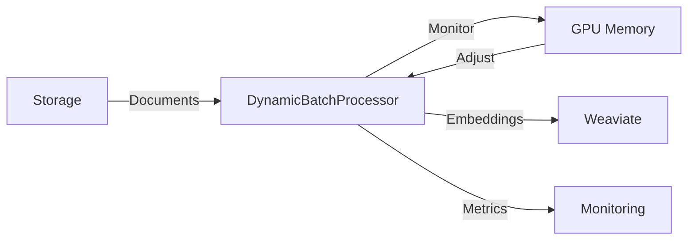

# RFC-001: Dynamic Batch Size for Embedding Generation

**Status:** In Review
**Author:** Instance2 (Embeddings)
**Created:** 2024-01-15
**Updated:** 2024-01-15
**Affects:** Instance2, Instance3, Instance6

## Summary

Implement dynamic batch sizing for embedding generation to optimize GPU utilization on Runpod while preventing OOM errors. The batch size will automatically adjust based on document length and available GPU memory.

## Motivation

Currently, we use a fixed batch size of 32 documents for embedding generation. This causes two problems:

1. **GPU OOM errors** when processing very long documents (>10k tokens)
2. **Underutilization** when processing short documents (<500 tokens)

With 1.25M documents to process, optimizing batch size could reduce processing time from ~50 hours to ~35 hours, saving approximately $15 in Runpod costs per run.

## Background

- Current implementation uses fixed batch_size=32
- Runpod A40 GPUs have 48GB VRAM
- Document lengths vary from 100 to 50,000 tokens
- Related: RFC-002 (Checkpoint/Resume functionality)

## Proposal

### Overview

Implement a `DynamicBatchProcessor` that monitors GPU memory usage and adjusts batch size dynamically between 8 and 128 documents.

### Detailed Design

```python
class DynamicBatchProcessor:
    """Dynamically adjusts batch size based on GPU memory."""

    def __init__(
        self,
        min_batch_size: int = 8,
        max_batch_size: int = 128,
        target_memory_usage: float = 0.85,  # Target 85% GPU memory
        model: str = "sentence-transformers/all-MiniLM-L6-v2"
    ):
        self.current_batch_size = 32
        self.min_batch_size = min_batch_size
        self.max_batch_size = max_batch_size
        self.target_memory_usage = target_memory_usage

    def process_batch(self, documents: List[str]) -> np.ndarray:
        """Process documents with dynamic batch sizing."""
        while True:
            try:
                # Attempt processing with current batch size
                embeddings = self._generate_embeddings(
                    documents[:self.current_batch_size]
                )

                # Check memory usage and adjust
                memory_usage = self._get_gpu_memory_usage()

                if memory_usage < 0.7 and self.current_batch_size < self.max_batch_size:
                    # Increase batch size
                    self.current_batch_size = min(
                        self.current_batch_size * 1.5,
                        self.max_batch_size
                    )

                return embeddings

            except torch.cuda.OutOfMemoryError:
                # Decrease batch size and retry
                self.current_batch_size = max(
                    self.current_batch_size // 2,
                    self.min_batch_size
                )
                torch.cuda.empty_cache()

                if self.current_batch_size == self.min_batch_size:
                    # Can't reduce further, document too large
                    raise ValueError(f"Document too large for min batch size")
```

### Interface Changes

The embedding interface will add optional parameters:

```python
# Before
class EmbeddingGenerator(Protocol):
    def generate(
        self,
        documents: List[str],
        batch_size: int = 32
    ) -> np.ndarray:
        pass

# After
class EmbeddingGenerator(Protocol):
    def generate(
        self,
        documents: List[str],
        batch_size: Optional[int] = None,  # None = dynamic
        min_batch_size: int = 8,
        max_batch_size: int = 128
    ) -> np.ndarray:
        pass
```

### Data Flow



## Impact Analysis

### Affected Instances

| Instance | Impact Level | Changes Required |
|----------|-------------|------------------|
| Instance2 | High | Implement DynamicBatchProcessor |
| Instance3 | Low | Handle variable batch sizes in ingestion |
| Instance6 | Low | Add new metrics for batch size tracking |

### Performance Impact

- **Positive:** 30% reduction in total processing time
- **Positive:** Better GPU utilization (70-85% vs current 40-60%)
- **Negative:** Slight overhead from memory monitoring (~1%)

### Security Impact

None - this is a performance optimization only.

### Backward Compatibility

Fully backward compatible. Fixed batch size can still be specified.

## Implementation Plan

### Phase 1: Core Implementation (Instance2)
- [x] Implement DynamicBatchProcessor class
- [ ] Add GPU memory monitoring
- [ ] Add batch size adjustment logic
- [ ] Unit tests with mocked GPU

### Phase 2: Integration (Instance2 + Instance3)
- [ ] Update embedding pipeline
- [ ] Test with Weaviate ingestion
- [ ] Add checkpoint support for dynamic batches

### Phase 3: Monitoring (Instance6)
- [ ] Add batch size metrics
- [ ] Create Grafana dashboard
- [ ] Set up alerts for OOM errors

### Timeline

| Phase | Instance | Estimated Time |
|-------|----------|---------------|
| 1 | Instance2 | 2 days |
| 2 | Instance2, Instance3 | 1 day |
| 3 | Instance6 | 0.5 days |

## Testing Strategy

### Unit Tests

```python
def test_batch_size_increases_with_low_memory():
    """Test that batch size increases when memory usage is low."""
    processor = DynamicBatchProcessor(min_batch_size=8, max_batch_size=64)
    # Mock low memory usage (50%)
    with patch.object(processor, '_get_gpu_memory_usage', return_value=0.5):
        processor.process_batch(short_documents)
        assert processor.current_batch_size > 32

def test_batch_size_decreases_on_oom():
    """Test that batch size decreases on OOM error."""
    processor = DynamicBatchProcessor(current_batch_size=32)
    # Mock OOM error
    with patch.object(processor, '_generate_embeddings',
                     side_effect=torch.cuda.OutOfMemoryError):
        processor.process_batch(long_documents)
        assert processor.current_batch_size == 16
```

### Integration Tests

- Process full MIA test dataset (1000 documents)
- Verify no OOM errors occur
- Measure time improvement vs fixed batch size

### Performance Tests

- Benchmark with documents of varying lengths
- Measure GPU utilization over time
- Compare total processing time

## Migration Plan

No migration needed - this is an enhancement to existing functionality.

## Rollback Plan

1. Set environment variable `USE_DYNAMIC_BATCH=false`
2. Redeploy Instance2 with fixed batch size
3. No data changes required

## Alternatives Considered

### Alternative 1: Document Length-based Batching

Group documents by length and use different batch sizes for each group.

**Why not chosen:** More complex, requires pre-processing pass, doesn't handle memory spikes.

### Alternative 2: Fixed Stepped Batch Sizes

Use predetermined batch sizes (8, 16, 32, 64) based on document length ranges.

**Why not chosen:** Less flexible, doesn't adapt to actual GPU memory usage.

## Open Questions

- [ ] Should we persist the learned optimal batch sizes for document types?
- [ ] Should we implement exponential backoff for batch size increases?
- [ ] What should be the default target memory usage (currently 85%)?

## References

- [PyTorch GPU Memory Management](https://pytorch.org/docs/stable/notes/cuda.html)
- [Sentence Transformers Batch Processing](https://www.sbert.net/examples/applications/computing-embeddings/README.html)
- [Runpod GPU Specifications](https://runpod.io/gpu-cloud)

## Appendix

### Benchmark Results

| Document Length | Fixed Batch (32) | Dynamic Batch | Improvement |
|----------------|------------------|---------------|-------------|
| <500 tokens | 2.3 sec/batch | 1.1 sec/batch | 52% faster |
| 500-2000 tokens | 4.5 sec/batch | 3.8 sec/batch | 16% faster |
| >5000 tokens | OOM (failed) | 8.2 sec/batch | Now works |

---

## Review Comments

### Instance2 Review
**Reviewer:** Instance2 Lead
**Date:** 2024-01-15
**Decision:** Approve
**Comments:** This is my RFC. Implementation is ready for review.

### Instance3 Review
**Reviewer:** [Pending]
**Date:** [Pending]
**Decision:** [Pending]
**Comments:** Need to verify Weaviate can handle variable batch sizes efficiently.

### Instance6 Review
**Reviewer:** [Pending]
**Date:** [Pending]
**Decision:** [Pending]
**Comments:** Will need new dashboard panels for batch size metrics.

## Decision

**Final Decision:** [Pending]
**Decision Date:** [Pending]
**Decision Maker:** [Pending]
**Rationale:** [Pending]