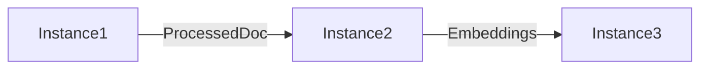

# RFC-XXXX: [Title]

**Status:** Draft | In Review | Approved | Implemented | Rejected
**Author:** [Instance Name]
**Created:** [Date]
**Updated:** [Date]
**Affects:** [List of instances affected]

## Summary

[One paragraph summary of the proposed change]

## Motivation

[Why are we doing this? What problem does it solve? What use cases does it support?]

## Background

[Relevant context and prior art. Link to related RFCs, issues, or documentation]

## Proposal

### Overview

[High-level description of the solution]

### Detailed Design

[Technical details of the implementation]

```python
# Code examples if relevant
```

### Interface Changes

[Any changes to interfaces between instances]

```python
# Before
class OldInterface:
    def old_method(self) -> str:
        pass

# After
class NewInterface:
    def new_method(self) -> Dict[str, Any]:
        pass
```

### Data Flow

[How data flows through the system with this change]



## Impact Analysis

### Affected Instances

| Instance | Impact Level | Changes Required |
|----------|-------------|------------------|
| Instance1 | High/Medium/Low | Description of changes |
| Instance2 | High/Medium/Low | Description of changes |

### Performance Impact

[Expected impact on performance, if any]

### Security Impact

[Security considerations and mitigations]

### Backward Compatibility

[Is this change backward compatible? Migration strategy if not]

## Implementation Plan

### Phase 1: [Title]

- [ ] Task 1
- [ ] Task 2

### Phase 2: [Title]

- [ ] Task 3
- [ ] Task 4

### Timeline

| Phase | Instance | Estimated Time |
|-------|----------|---------------|
| 1 | Instance1 | 2 days |
| 2 | Instance2 | 3 days |

## Testing Strategy

### Unit Tests

[Approach to unit testing]

### Integration Tests

[Cross-instance testing approach]

### Performance Tests

[Performance validation approach]

## Migration Plan

[If applicable, how to migrate existing data/code]

1. Step 1
2. Step 2
3. Step 3

## Rollback Plan

[How to rollback if issues arise]

## Alternatives Considered

### Alternative 1: [Name]

[Description and why it wasn't chosen]

### Alternative 2: [Name]

[Description and why it wasn't chosen]

## Open Questions

- [ ] Question 1?
- [ ] Question 2?

## References

- [Link to relevant documentation]
- [Link to related RFC]
- [Link to issue/ticket]

## Appendix

[Additional information, benchmarks, detailed examples]

---

## Review Comments

[Space for reviewers to add comments]

### Instance1 Review

**Reviewer:** [Name]
**Date:** [Date]
**Decision:** Approve/Request Changes/Reject
**Comments:**

### Instance2 Review

**Reviewer:** [Name]
**Date:** [Date]
**Decision:** Approve/Request Changes/Reject
**Comments:**

## Decision

**Final Decision:** [Approved/Rejected]
**Decision Date:** [Date]
**Decision Maker:** [Name]
**Rationale:** [Brief explanation of the decision]
